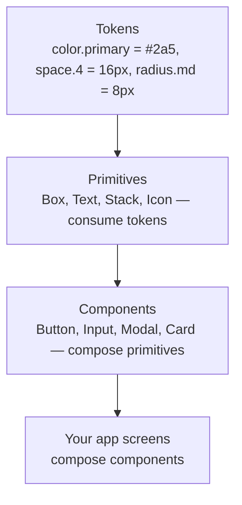
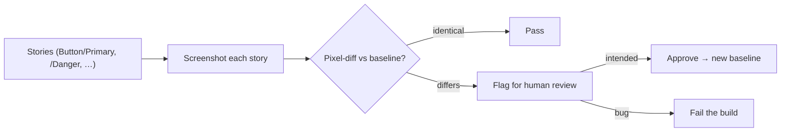

# Design Systems & Storybook

> **In one line:** A design system is the shared, reusable kit of tokens, primitives, and components a team builds UIs from — and Storybook is the workshop where you build and document those components in isolation.

→ **Going deeper:** a design system is built *on top of* a styling approach — [Styling](/docs/stack/styling) covers Tailwind, shadcn/ui, and CSS-in-JS, which are how you implement the tokens and components described here.

:::tip[In plain English]
Imagine ten engineers each building their own button. Now you have ten slightly different buttons — different blues, different padding, different focus rings, three of them inaccessible. Multiply that across inputs, modals, and cards, and your app looks like ten apps stitched together.

A **design system** fixes that: it's one shared, reusable set of UI pieces (plus the rules for using them) that everyone builds from. Think of it as a LEGO set for your product — a fixed palette of bricks that snap together consistently. **Storybook** is the bench where you build and inspect each brick on its own, before it ever goes into the app.
:::

## Terms, defined once

- **Design system** — The shared kit (tokens + primitives + components) *plus* the documentation and usage rules a team uses to build consistent UIs.
- **Design token** — A named design value: `color.primary`, `space.4`, `radius.md`, `font.size.lg`. The *single source of truth* for a design decision, referenced by everything instead of hardcoded.
- **Primitive** — The lowest-level building block: a `Box`, `Text`, `Stack`, or `Icon` that consumes tokens. You compose primitives into components.
- **Component** — A reusable, self-contained UI piece built from primitives and tokens: `Button`, `Input`, `Modal`, `Card`.
- **Storybook** — A tool that renders your components in isolation (outside the app), each in a sandboxed page, with controls, docs, and tests.
- **Story** — A single rendered state of a component (e.g. "Button / Primary," "Button / Disabled"). The unit Storybook displays and tests.
- **Visual-regression test** — A test that screenshots a component and flags any *pixel* difference from a saved baseline, catching unintended visual changes.
- **Accessible (a11y)** — Usable by everyone, including people using keyboards and screen readers (focusable, labeled, correct roles, visible focus).

## The layers: tokens → primitives → components

A design system is built bottom-up in three layers. Each layer only references the one below it.



**Why bottom-up matters:** change a single token — say `color.primary` from green to indigo — and *every* button, link, and focus ring updates at once, because nothing hardcoded the old value. This is the whole payoff. Hardcode `#2a5` in fifty places and a rebrand is a fifty-file find-and-replace; reference `color.primary` and it's a one-line change.

:::info[Highlight: tokens are the source of truth]
A design token is just a named value with one job: be the *only* place a design decision lives. `space.4` instead of `16px`, `color.danger` instead of `#e11`. Tokens get implemented differently depending on your stack — as CSS custom properties (`--color-primary`), as a Tailwind theme config, or as a TypeScript object — but the principle is constant: **reference the name, never the raw value.**
:::

## Why teams use one

- **Consistency** — One button, one input, one spacing scale. The product looks like one product, not ten.
- **Speed** — Engineers compose from a kit instead of rebuilding (and re-deciding) basics every feature.
- **Accessibility, once** — Get the focus ring, ARIA roles, and keyboard handling right *inside* the `Button` component, and every button in the app inherits it. You don't re-litigate a11y per feature.
- **Easy rebrands** — Change tokens, not components. The indigo example above.
- **A shared language** — Designers and engineers both say "use the `danger` Button," and mean the same thing.

The famous public examples — Material (Google), Polaris (Shopify), Carbon (IBM), Primer (GitHub) — exist because at scale, *not* having one is more expensive than building one. **shadcn/ui** (see [Styling](/docs/stack/styling)) is the popular 2026 starting point: you copy accessible component source into your repo and own it.

## Building an accessible reusable component

Accessibility is a *property of the component*, baked in once. A good `Button` is keyboard-focusable, announces its disabled state, shows a visible focus ring, and has an accessible label even when it's icon-only.

```tsx
// Button.tsx — consumes tokens, accessible by default
import { type ButtonHTMLAttributes } from 'react';

type ButtonProps = ButtonHTMLAttributes<HTMLButtonElement> & {
  variant?: 'primary' | 'secondary' | 'danger';
};

export function Button({ variant = 'primary', className, ...props }: ButtonProps) {
  return (
    <button
      // a real <button>: focusable + Enter/Space activation for free
      className={`btn btn-${variant} ${className ?? ''}`}
      {...props}  // forwards aria-*, disabled, onClick, type, etc.
    />
  );
}
```

```css
/* Styles reference TOKENS, never raw values */
.btn {
  padding: var(--space-2) var(--space-4);
  border-radius: var(--radius-md);
  font: var(--font-button);
}
.btn-primary { background: var(--color-primary); color: var(--color-on-primary); }
.btn-danger  { background: var(--color-danger);  color: var(--color-on-danger);  }

/* Visible focus ring — never remove it without a replacement */
.btn:focus-visible { outline: 2px solid var(--color-focus); outline-offset: 2px; }

/* Communicate disabled visually AND it's already announced via the disabled attr */
.btn:disabled { opacity: 0.5; cursor: not-allowed; }
```

> **In English:** Using a real `<button>` element (not a styled `<div>`) gives you keyboard focus, Enter/Space activation, and the right screen-reader role *for free* — the single most important accessibility decision. Spreading `{...props}` forwards `aria-label`, `disabled`, `onClick`, and `type`, so a caller can pass `aria-label="Delete"` to an icon button. Every visual value comes from a `var(--token)`, so a token change restyles all buttons. The `:focus-visible` outline is non-negotiable: removing focus rings without a replacement is the most common a11y regression in real codebases.

## Storybook — isolated component development

Building a component *inside* a full app is slow: you have to navigate to the right screen, log in, get the data into the right state just to see the "error" variant. **Storybook** renders each component on its own blank page, so you develop and review every state directly.

A **story** is one state of a component. You write them in a `*.stories.tsx` file next to the component:

```tsx
// Button.stories.tsx
import type { Meta, StoryObj } from '@storybook/react';
import { Button } from './Button';

const meta: Meta<typeof Button> = {
  title: 'Components/Button',
  component: Button,
  args: { children: 'Click me' },     // default props for all stories
};
export default meta;

type Story = StoryObj<typeof Button>;

export const Primary: Story = { args: { variant: 'primary' } };
export const Danger: Story = { args: { variant: 'danger' } };
export const Disabled: Story = { args: { disabled: true } };
```

> **In English:** The default export (`meta`) tells Storybook which component this file documents and gives shared default `args` (props). Each named export is a *story* — a specific prop combination Storybook renders as its own entry in the sidebar (`Components/Button/Primary`, `/Danger`, `/Disabled`). Storybook auto-generates interactive controls from the prop types, so a reviewer can toggle `variant` or `disabled` live without touching code, and the docs page is generated for free.

**What Storybook gives you:**

- **Isolation** — Build the "loading" or "error" state without wrestling the whole app into it.
- **Living docs** — Auto-generated, always-current component documentation (the old hand-maintained style guide is obsolete the day it ships).
- **A review surface** — Designers and PMs review components in the browser without running your app.
- **A test target** — Stories double as fixtures for accessibility and visual-regression tests.

## Visual-regression testing

Unit tests check behavior; they happily pass while your button silently turns the wrong shade of blue or loses 4px of padding. **Visual-regression testing** catches *appearance* changes: it screenshots each story, compares it pixel-by-pixel to a saved **baseline**, and fails the build on any diff you didn't approve.



> **In English:** Each story is screenshotted and compared to the approved baseline image. Identical → pass. Different → a human reviews the diff: if the change was intentional (a redesign), you *accept* it and that screenshot becomes the new baseline; if it was an accident (a stray CSS change broke the padding), the build fails and you fix it. Tools that do this include **Chromatic** (built by the Storybook team), **Playwright** screenshots, and **Percy**. The point: pixels get a test, not just logic.

## Worked example, traced: a Button from token to test

Follow one button through the whole pipeline.

1. **Token.** A designer sets `color.primary = #2a5`. It lands in the theme as `--color-primary` (or a Tailwind config key). Nothing else hardcodes that green.
2. **Component.** `Button` renders a real `<button>`, pulls its background from `var(--color-primary)`, adds a `:focus-visible` ring, forwards `{...props}` (so `aria-label`, `disabled`, `onClick` all work), and exposes a `variant` prop.
3. **Stories.** `Button.stories.tsx` declares `Primary`, `Danger`, and `Disabled`. Storybook lists them in the sidebar; a reviewer toggles `variant` live and confirms the disabled state is dimmed and unclickable.
4. **a11y check.** The Storybook accessibility addon scans each story: the `Disabled` story passes (real `disabled` attribute is announced), and an icon-only variant would *fail* until you add `aria-label` — caught before it ships.
5. **Visual baseline.** CI screenshots all three stories and saves them as the baseline.
6. **A change arrives.** Someone edits `--color-primary` to indigo. *Every* button updates at once (the token payoff). Visual-regression flags all three stories as changed; the team reviews, confirms it's the intended rebrand, and **accepts** the new baselines. Had the same diff come from an accidental `padding` typo, the same check would have **failed the build** instead — the bug caught before a user ever saw it.

## Why it matters

Past a few engineers, UI consistency and accessibility don't happen by discipline — they happen by *infrastructure*. A design system is that infrastructure: it makes the consistent, accessible choice the *easy* choice (just use the `Button`), so quality scales with the team instead of degrading. Storybook and visual-regression testing are how you keep that kit trustworthy as it grows — you can change a token fearlessly because the tests will tell you exactly what moved. On a real team you will *consume* a design system on day one and *contribute* to one soon after; knowing the tokens → primitives → components model and the Storybook workflow is everyday work, not a nice-to-have.

## Common mistake

:::caution[Where people commonly trip up]
- **Hardcoding values instead of referencing tokens.** Writing `#2a5` or `16px` directly in a component defeats the entire purpose — a rebrand becomes a global find-and-replace. Always reference `var(--color-primary)` / `space.4` / the theme key.
- **Building a `<div onClick>` instead of a real `<button>`.** A styled `div` looks like a button but isn't focusable, isn't keyboard-activatable, and has no button role. Use the semantic element; only reach for ARIA when no native element fits.
- **Removing the focus ring "because it's ugly."** `outline: none` with no replacement makes the component unusable by keyboard users. If the default ring clashes, *restyle* `:focus-visible` — never delete it.
- **Treating Storybook docs as the deliverable.** Stories aren't busywork; they're your fixtures for a11y and visual-regression tests *and* living docs. Skipping them means manual review forever.
- **Auto-accepting every visual diff.** The whole value of visual-regression testing is the human review step. Rubber-stamping "accept all" turns it into noise and lets real regressions through. Review each diff; accept only intended changes.
- **Building a design system before you need one.** For a solo project or a 3-page site, a full token-pipeline + Storybook setup is over-engineering. Reach for shadcn/ui (copy the components you need) and grow into a formal system when multiple people start building UI.
:::

## Page checkpoint

<Quiz id="stack-design-systems-storybook-page" title="Did design systems & Storybook stick?" sampleSize={3} passingScore={2}>

<Question
  prompt="What is the relationship between tokens, primitives, and components in a design system?"
  options={[
    { text: "They're three names for the same thing" },
    { text: "Tokens are named design values; primitives consume tokens; components compose primitives — each layer references the one below" },
    { text: "Components define tokens, which define primitives" },
    { text: "Primitives are the screenshots used for visual-regression testing" }
  ]}
  correct={1}
  explanation="A design system is built bottom-up: tokens (named values like color.primary) → primitives (Box, Text that consume tokens) → components (Button, Modal that compose primitives). Because nothing hardcodes raw values, changing one token updates every component at once."
  revisit={{ to: "/docs/stack/design-systems-storybook#the-layers-tokens--primitives--components", label: "Tokens → primitives → components" }}
/>

<Question
  prompt="Why build a Button on a real `button` element rather than a styled `div` with an onClick handler?"
  options={[
    { text: "A div renders faster than a button" },
    { text: "A real button element is keyboard-focusable, activatable with Enter/Space, and has the correct screen-reader role — accessibility for free" },
    { text: "Divs can't have CSS classes" },
    { text: "Storybook only renders semantic HTML elements" }
  ]}
  correct={1}
  explanation="Using the semantic <button> gives you keyboard focus, Enter/Space activation, and the right role automatically. A styled div looks the same but is unusable by keyboard and screen-reader users unless you re-add all that behavior by hand."
  revisit={{ to: "/docs/stack/design-systems-storybook#building-an-accessible-reusable-component", label: "Accessible component" }}
/>

<Question
  prompt="What does Storybook give you that building a component inside the full app does not?"
  options={[
    { text: "It deploys your app to production" },
    { text: "It renders each component (and each of its states) in isolation, with auto-generated controls, docs, and a target for a11y/visual tests" },
    { text: "It replaces your need for a database" },
    { text: "It automatically writes your components for you" }
  ]}
  correct={1}
  explanation="Storybook renders each component on its own page so you can develop and review every state (loading, error, disabled) directly — no navigating the app into that state. Stories also double as living docs and as fixtures for accessibility and visual-regression tests."
  revisit={{ to: "/docs/stack/design-systems-storybook#storybook--isolated-component-development", label: "Storybook" }}
/>

<Question
  prompt="What does visual-regression testing catch that ordinary unit tests miss?"
  options={[
    { text: "Network timeouts" },
    { text: "Unintended appearance changes — it screenshots each story and pixel-diffs it against an approved baseline, flagging any visual difference for human review" },
    { text: "TypeScript type errors" },
    { text: "Memory leaks in the component" }
  ]}
  correct={1}
  explanation="Unit tests check behavior and pass even when a button turns the wrong color or loses padding. Visual-regression testing screenshots each story, compares it pixel-by-pixel to a saved baseline, and flags any diff — intended changes get accepted as the new baseline, accidental ones fail the build."
  revisit={{ to: "/docs/stack/design-systems-storybook#visual-regression-testing", label: "Visual-regression testing" }}
/>

</Quiz>

## What's next

→ Continue to [Backend Frameworks](./backend-frameworks) — the server-side equivalent of frontend frameworks.
