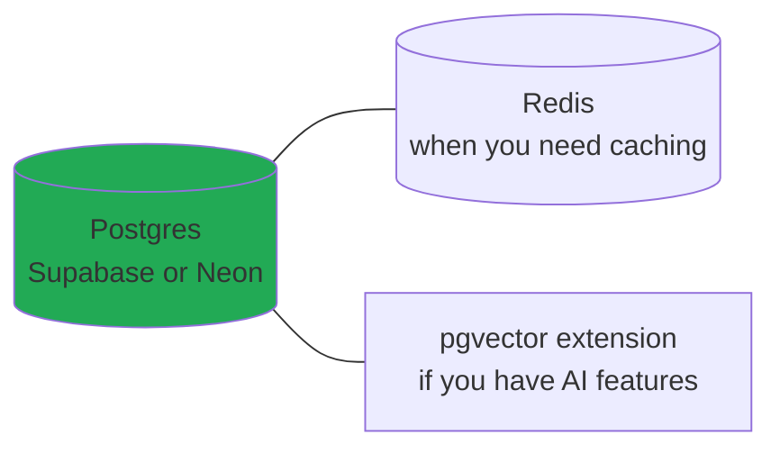

# Databases (Tools)

> **In one line:** Postgres for the data. Redis for the cache. SQLite at the edge. Specialized databases (search, vector, graph) only when Postgres can't.

→ **Going deeper:** [Advanced Databases](/docs/stack/databases-advanced) covers indexes and the query planner (`EXPLAIN`), transaction isolation, the N+1 problem, and safe schema migrations.

:::tip[In plain English]
The database is where your app's data actually lives. The 2026 default is **PostgreSQL** — open-source, mature, has extensions for almost every specialized need (vectors, time-series, geospatial, full-text search). Add **Redis** when you need fast caching. Reach for anything else only when you have a *specific* problem Postgres can't solve.
:::

## PostgreSQL — the default

In 2026, PostgreSQL is the default relational database for almost every new project.

**Why:**

- Open-source, no licensing concerns.
- Feature-rich (JSON, full-text search, GIS, time-series, vectors).
- Excellent extension ecosystem.
- Mature managed offerings.
- Strong ACID guarantees.

**Notable extensions:**

- **pgvector** — Vector similarity search (for AI/RAG).
- **PostGIS** — Geographic data.
- **TimescaleDB** — Time-series optimization.
- **pg_search** — Full-text search.
- **pg-boss** — Background jobs.

## Managed Postgres providers

| Provider           | Notes                                                       |
|--------------------|-------------------------------------------------------------|
| **Supabase**        | Postgres + Auth + Storage + Realtime + Edge Functions. All-in-one backend. |
| **Neon**            | Serverless Postgres with branching (each PR can have its own DB branch). |
| **Railway**         | Simple managed DB alongside app hosting.                   |
| **PlanetScale (Postgres)** | Branching, schema changes without locks.            |
| **AWS RDS**         | Mature, full control, more operational burden.             |
| **Google Cloud SQL / Azure Database** | Same idea for other clouds.                |

## SQLite

A single-file database. Used to be considered "embedded only," but in 2026 it's production-viable via:

- **Cloudflare D1** — SQLite at the edge.
- **Turso** — Distributed SQLite with replication.
- **Litestream** — Streaming backup for SQLite to S3.

**When SQLite makes sense:** Edge-first apps, single-region apps with moderate write volume, apps that benefit from running queries with zero network latency.

## MySQL

Still common in legacy systems. PlanetScale popularized serverless MySQL (now deprecated in favor of Postgres).

For new projects, Postgres is almost always preferred.

## MongoDB

Document database. Popular in 2015–2020.

**Where it still fits:** Apps with genuinely schemaless data, content management systems, certain analytics workloads.

**Where Postgres beats it:** Almost everything else. Postgres's JSON columns + relational data are usually better.

## DynamoDB (AWS)

Serverless NoSQL store. Scales infinitely, predictable performance.

**When to use:** AWS-native apps with simple access patterns; massive scale where Postgres limits are real.
**Trade-off:** Hard to query in flexible ways; "you must know your access patterns up front."

## Redis / Valkey

In-memory key-value store. Used for:

- Caching
- Session storage
- Rate limiting
- Job queues (with BullMQ)
- Leaderboards (sorted sets)
- Pub/sub messaging

**Managed:** Upstash (serverless), Redis Cloud, AWS ElastiCache.

**Valkey** is the open-source fork after Redis's license change. Many cloud providers are migrating to it.

## Search engines

| Engine          | Notes                                                          |
|-----------------|----------------------------------------------------------------|
| **Typesense**    | Modern, fast, easy to operate. Popular for new projects.       |
| **Meilisearch**  | Similar to Typesense; great DX.                                |
| **Algolia**      | Hosted, very fast, expensive at scale.                          |
| **Elasticsearch**| Powerful, complex, dominant historically.                       |

**Often, Postgres full-text search is enough** — one less service to operate.

## Vector databases

For storing embeddings (high-dimensional vectors that represent meaning).

- **pgvector** — Postgres extension; the popular 2026 choice.
- **Pinecone** — Managed, easy to start.
- **Qdrant** — Open-source, fast.
- **Weaviate** — Open-source, feature-rich.
- **Turbopuffer** — Newer, cost-optimized.

**Recommendation:** Use pgvector unless you have specific needs that justify a separate service.

## Analytics databases

For OLAP (analytical queries on large datasets):

- **ClickHouse** — Columnar, blazing fast.
- **DuckDB** — In-process analytics; great for local data work.
- **Snowflake / BigQuery** — Cloud data warehouses.

## Graph databases

For data with complex relationships (social networks, recommendations):

- **Neo4j** — Most popular, Cypher query language.
- **Amazon Neptune** — AWS managed.

Often Postgres + recursive CTEs is enough for "I just need some graph queries" use cases.

:::info[Highlight: the 2026 default data stack]
For 95% of new projects, this is the right starting point:

That's it. One DB to back up. One mental model. One ops burden. Add specialized databases only when Postgres genuinely can't handle the job — which, in 2026, is rare.
:::

## Common mistakes

:::caution[Where people commonly trip up]
- **Reaching for MongoDB because "my data is unstructured."** It almost never is. Users, orders, posts, and comments are relational — and Postgres has a `jsonb` column for the genuinely schemaless bits. You get joins, transactions, and constraints *for free*; in Mongo you'd hand-roll them.
- **Adding a dedicated vector database before you've shipped one AI feature.** pgvector inside the Postgres you already run is the right starting point. Pinecone/Qdrant/Weaviate add a service to operate, a second source of truth, and another bill. Move to one only when pgvector hits a real wall.
- **Treating Redis as durable storage.** Redis is in-memory; a restart or eviction can drop your data. Use it for caches, sessions, rate limits, queues — never as the system of record. If you need persistence, that's Postgres's job.
- **Connecting to Postgres from a serverless function without a connection pooler.** Each cold start opens a fresh connection; under load you hit the connection limit and the whole DB falls over. Use a pooler (PgBouncer, Supabase's pooler, Neon's connection pooling) for serverless workloads.
- **Skipping indexes until the query is slow.** By then, "slow" means a customer-facing outage. Index foreign keys and any column you filter or sort by — that's table stakes, not optimization.
- **Picking DynamoDB because it "scales infinitely."** It does, but only along the access patterns you designed for. Add a new query shape later and you're rebuilding tables. If you can't enumerate every query up front, you want Postgres.
:::

## Page checkpoint

<Quiz id="stack-databases-page" title="Did databases stick?" sampleSize={2}>

<Question
  prompt="What's the page's default database recommendation for almost every new project in 2026?"
  options={[
    { text: "MongoDB" },
    { text: "DynamoDB" },
    { text: "PostgreSQL" },
    { text: "MySQL" }
  ]}
  correct={2}
  explanation="Postgres is open-source, mature, and has extensions for almost every specialized need (vectors via pgvector, GIS, time-series, full-text search). Reach for something else only when Postgres genuinely can't solve your problem."
  revisit={{ to: "/docs/stack/databases#postgresql--the-default", label: "PostgreSQL section" }}
/>

<Question
  prompt="Which extension lets you do vector similarity search for AI/RAG features inside Postgres — without a separate vector database?"
  options={[
    { text: "PostGIS" },
    { text: "pg_search" },
    { text: "pgvector" },
    { text: "TimescaleDB" }
  ]}
  correct={2}
  explanation="pgvector is the popular 2026 choice for storing and querying embeddings. Using it means one fewer service to operate vs. a dedicated vector DB like Pinecone or Qdrant."
  revisit={{ to: "/docs/stack/databases#vector-databases", label: "Vector databases" }}
/>

<Question
  prompt="What is Redis (or its open-source fork Valkey) typically used for in a modern web stack?"
  options={[
    { text: "Primary relational storage for user accounts and orders" },
    { text: "An in-memory key-value store for caching, sessions, rate limiting, and job queues" },
    { text: "Long-term archival of analytics events" },
    { text: "A full-text search engine for product catalogs" }
  ]}
  correct={1}
  explanation="Redis/Valkey is in-memory and fast: it's used for caching, session storage, rate limiting, BullMQ-style job queues, leaderboards (sorted sets), and pub/sub — not as the system of record."
  revisit={{ to: "/docs/stack/databases#redis--valkey", label: "Redis / Valkey" }}
/>

<Question
  prompt="What makes SQLite production-viable for many apps in 2026, where five years ago it would have been 'embedded only'?"
  options={[
    { text: "It now ships with built-in horizontal sharding" },
    { text: "It became a managed service from AWS" },
    { text: "Edge-friendly offerings like Cloudflare D1 and Turso, plus tools like Litestream for streaming backups" },
    { text: "It added a network protocol so clients can connect over TCP" }
  ]}
  correct={2}
  explanation="Cloudflare D1, Turso (distributed SQLite with replication), and Litestream (streaming backup to S3) turned SQLite into a serious option for edge-first or single-region apps with moderate write volume."
  revisit={{ to: "/docs/stack/databases#sqlite", label: "SQLite section" }}
/>

</Quiz>

## What's next

→ Continue to [ORMs & Database Tools](./orms) — the layer that translates between your code and SQL.
