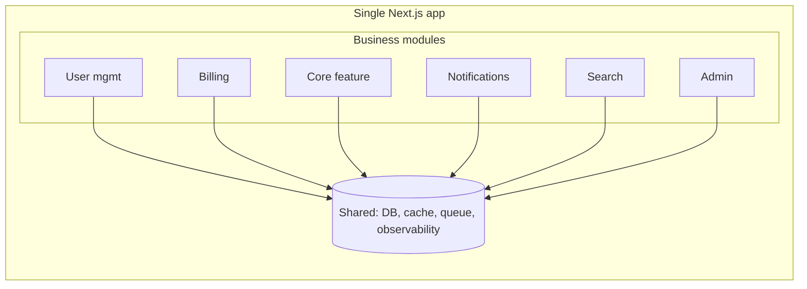

# Phase 3: Architecture

> **In one line:** The reigning 2026 pattern for small companies is the *modular monolith* — one Next.js app, internally organized so modules can later be split if (rarely) needed.

:::tip In plain English
"Microservices vs monolith" is a fake debate at this scale. The right answer is almost always a single deployable app, with clean module boundaries inside it. You get one deploy, one log stream, one debugger, one set of tests — and the *option* to split later if a specific module truly outgrows the monolith. Most never need to.
:::

## The modular monolith

The reigning 2026 pattern for small companies: **modular monolith** — one deployable app divided internally into clearly-bounded modules (often one folder per business domain).



All deployed as one Next.js app. Internally organized so that modules can later be split into services if needed (but most never need to be).

## The dominant 2026 small-company stack

| Layer            | Tool                                              |
|------------------|---------------------------------------------------|
| Frontend + SSR   | Next.js 15 (App Router)                           |
| Language         | TypeScript (strict mode)                          |
| UI               | shadcn/ui + Tailwind CSS v4                       |
| Internal API     | tRPC or Server Actions                            |
| Public API       | REST with OpenAPI (if needed for partners/SDK)    |
| Database         | PostgreSQL via Supabase or Neon                   |
| ORM              | Drizzle                                           |
| Auth             | Clerk or Better Auth                              |
| Background jobs  | Trigger.dev or Inngest                            |
| Payments         | Stripe (or Paddle/Lemon Squeezy for global tax)   |
| Email            | Resend                                            |
| Files            | Cloudflare R2                                     |
| Search           | Postgres full-text → Typesense if needed          |
| Observability    | Sentry + PostHog + Better Stack                   |
| Feature flags    | PostHog or Statsig                                |
| Hosting          | Vercel + Supabase (or Railway, or Cloudflare)     |
| CI/CD            | GitHub Actions + Vercel auto-deploys              |
| Secrets          | Doppler or Vercel/Supabase env vars               |

**This stack handles roughly the first $10M+ in ARR for most modern SaaS companies.** It scales further with minor adjustments (read replicas, caching layers) without architectural rewrites.

## RFCs (Request for Comments)

Major architectural changes get an **RFC** (Request for Comments — a short written proposal circulated before the work starts, so the team can debate the design while it's still cheap to change):

```markdown
# RFC: Move from Server Actions to tRPC

## Context
We've grown to 8 engineers and 30+ Server Actions. They're becoming
hard to track and lack a unified validation/error pattern.

## Proposal
Migrate to tRPC for our internal API. Server Actions remain for
form submissions; tRPC handles all other mutations and queries.

## Alternatives Considered
1. Keep Server Actions, add stricter conventions.
2. Move to REST with OpenAPI.

## Trade-offs
+ Better DX, type safety end-to-end
+ Unified error handling
- Migration cost: ~2 weeks of one engineer
- Learning curve for new hires

## Decision
Proposed; needs sign-off from CTO and frontend lead.
```

> **Reading this RFC:** Every RFC follows the same shape — Context (why we're considering this), Proposal (the actual change), Alternatives Considered (what we rejected and why), Trade-offs (honest pros and cons), Decision (status and who signs off). The discipline of writing it forces you to think before you migrate, and the artifact survives so future engineers understand the *why* without having to ask.

RFCs become a useful artifact — future engineers understand why decisions were made.

:::note Worked example: a module boundary that paid off
A 14-person SaaS organized its Next.js app into modules: `billing/`, `auth/`, `core/`, `admin/`. Each module exports a clean API; modules don't reach into each other's internals. The DB schema is shared, but each module owns specific tables.

Two years in, the billing logic gets complicated enough (multi-currency, tax, dunning, invoicing) that the team wants to extract it. Because of the clean module boundary, extracting `billing/` into a separate service takes about three weeks instead of the three months it would have taken from a tangled codebase.

The lesson: the modular monolith isn't "we'll never split." It's "we'll split *if and when* a specific module needs it, and we'll be ready when that day comes."
:::

:::info Highlight: $10M ARR is a lot
The "handles up to $10M ARR" claim isn't marketing — it's the actual track record of this stack. Companies you've heard of run on essentially this configuration well past 50 engineers. The architectural decisions to revisit at $10M+ are usually: read replicas, a queue + worker for heavy background work, and possibly extracting one or two modules into services. Not "rewrite everything."
:::

## What's next

→ Continue to [Phase 4: Environment Setup](./env-setup) where we cover monorepo structure, onboarding scripts, and secrets.
