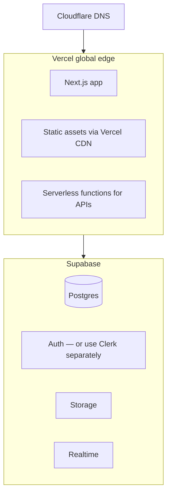
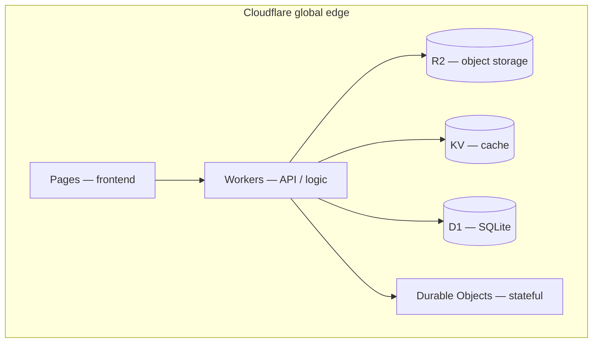

# Phase 8: Deployment & Infrastructure

> **In one line:** Three popular hosting patterns — Vercel + Supabase (easy), Railway/Render (predictable bills), Cloudflare-first (global edge). Pick by your traffic shape and bill tolerance.

:::tip In plain English
Hosting is one of the few areas where a small company genuinely has options. Vercel + Supabase is the default for a reason — it's the lowest-friction path. But if your bills spike unpredictably with usage, or you need persistent WebSocket connections, or you want global edge from day one, the alternatives are real. The choice has more to do with your specific app than with which is "best."
:::

## Pattern A: Vercel + Supabase (Most Popular)

:::info Jargon
- **Edge** — code running in data centers physically close to the user (lower latency, but a stripped-down runtime).
- **Serverless functions** — short-lived functions the platform runs on demand; you pay per invocation, no servers to manage.
- **CDN** (Content Delivery Network) — a global cache of static files (JS, CSS, images) so the browser fetches them from a nearby node.
:::

- **Vercel** hosts Next.js (edge + serverless functions).
- **Supabase** provides Postgres + Auth + Realtime + Storage + Edge Functions.
- **Cloudflare R2** for file storage if not using Supabase Storage.
- **Resend** for email.
- **Trigger.dev** for background jobs.

**Pros:** Easiest, fastest, best DX, scales smoothly to substantial traffic.
**Cons:** Vercel bills can spike unexpectedly with traffic; some lock-in.

## Pattern B: Railway / Render (More Flexible)

- **Railway / Render** runs your app in containers.
- Predictable pricing (you pay for compute, not per request).
- Good when you need long-running processes (WebSocket servers, persistent connections).

**Pros:** Predictable bills, single platform, more control.
**Cons:** No global edge presence; you may need a separate CDN.

## Pattern C: Cloudflare-First (Edge-Native)

- **Cloudflare Pages + Workers** runs the app at the edge globally.
- **Cloudflare D1** (SQLite) or external Postgres for data.
- **Cloudflare R2** for storage.
- **Cloudflare KV / Durable Objects** for state.

**Pros:** Cheap, fast, globally distributed by default.
**Cons:** Edge runtime constraints (smaller compute, no long-running processes), some libraries don't work.

## Choosing Between Them

| Need                              | Pattern        |
|-----------------------------------|----------------|
| Standard SaaS, easy DX            | A (Vercel)     |
| Bills must be predictable         | B (Railway)    |
| Global low-latency app            | C (Cloudflare) |
| Need persistent connections       | B (Railway)    |
| Maximum free-tier value           | C (Cloudflare) |

:::note Worked example: a Vercel bill that surprised the team
A startup launches a viral feature. Traffic 5x's overnight. The next Vercel bill is $2,800 instead of $400 — they hit function-invocation limits, image-optimization charges, and bandwidth tiers all at once.

The team has three options:
1. Stay on Vercel and absorb the cost (reasonable if revenue scaled too).
2. Add caching aggressively to bring invocations down (often the right answer).
3. Move to Railway for predictable per-month billing (right answer if the cost-spike scares investors).

None is "wrong." But this is the kind of decision that lives on the boundary between Patterns A and B. Knowing it exists in advance lets you make the call calmly.
:::

:::info Highlight: edge constraints are real
"Just use Cloudflare Workers" looks like the obvious answer until you discover Node-specific libraries that don't work, runtime memory limits that bite mid-development, and an ecosystem that's smaller than Vercel's. Pattern C is the right call for global low-latency apps from day one, but it's a real commitment — not a minor tweak.
:::

## What's next

→ Continue to [Phase 9: Observability](./observability) where Sentry, logs, uptime, and product analytics combine into a real production-monitoring story.
