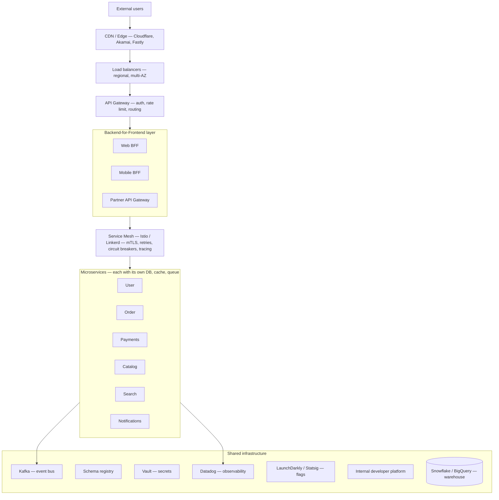

# Phase 2: Architecture

> **In one line:** At enterprise scale, the system is a fleet of microservices behind an API gateway, glued together by a service mesh and an event bus, supported by an internal developer platform that hides the complexity from product engineers.

:::tip In plain English
A startup typically runs a single Next.js app talking to a single Postgres database. An enterprise typically runs hundreds or thousands of small services, each owned by a different team, each with its own database, talking to each other through standardized communication layers.

Why? Because at this scale, no single team can know the whole codebase, and any change anywhere needs to be safe. Splitting the system into independently-owned services lets each team move at its own pace without breaking each other.
:::

## Microservices and SOA

**Microservices** (many small, independently-deployed services each owning one capability) or **service-oriented architecture (SOA)** (the older, broader umbrella term for the same idea) is the norm at this scale:

- Dozens to thousands of services.
- Each service is owned by a specific team.
- Database-per-service pattern: each service owns its data; other services access it only via the service's API.
- Services communicate via **gRPC** (a high-performance binary RPC protocol, typically used inside the cluster), REST/GraphQL (external), or events (Kafka).

:::info Jargon (used throughout this page)
- **API Gateway** — a single entry point that authenticates external requests, enforces rate limits, and routes them to the right backend service.
- **BFF** (Backend-for-Frontend) — a thin service tailored to one client (web, mobile, partner API) that stitches together calls to the underlying microservices.
- **Service mesh** — a layer of sidecar proxies (usually Envoy) injected next to each service that handles cross-cutting concerns like encryption and retries without each service having to.
- **mTLS** (mutual TLS) — both sides of a connection prove their identity with certificates; standard for service-to-service encryption.
- **Event bus** — a durable message stream (typically Kafka) where services publish events and other services subscribe, decoupling producers from consumers.
- **Multi-AZ** — deployed redundantly across multiple cloud Availability Zones so a single data-center failure doesn't take you down.
:::

## Key architectural components

**API Gateway:** Routes external traffic, handles auth, rate limiting, request validation. Options: Kong, AWS API Gateway, custom-built.

**Service mesh:** Handles service-to-service concerns: mTLS, retries, timeouts, circuit breaking, load balancing, distributed tracing. Options: Istio, Linkerd, Consul Connect.

**Event bus:** Async communication between services. Services publish events; other services subscribe. Decouples services and provides durability. Options: Apache Kafka (dominant), Apache Pulsar, AWS Kinesis, Google Pub/Sub.

**Schema registry:** Enforces contracts between services. Protocol Buffers (Protobuf) or Avro schemas. Producers can't ship breaking changes to event schemas without consumers' consent.

**Feature flag system:** Controls rollouts at fine granularity. LaunchDarkly is dominant; Statsig is rising.

**Distributed caching:** Redis Cluster, Memcached. Reduces DB load.

**Data warehouse:** Snowflake, BigQuery, Databricks. Analytics and ML.

:::info Highlight: the "database-per-service" rule
The single most important microservices discipline is **don't share a database between services**. The moment two services talk to the same database, you no longer have two services — you have one service with two front doors and a hidden coupling that will break in production.

The whole point of a service is that it can change its internal data model without coordinating with every other team in the company. Lose that, and you have all the cost of microservices with none of the benefit.
:::

## Internal Developer Platform (IDP)

An IDP abstracts cloud complexity from product engineers. Could be Backstage-based or custom. A mature IDP provides:

- **Service templates** (create a new service from a template).
- **Deployment tooling.**
- **Observability dashboards** per service.
- **Documentation portal.**
- **Service catalog.**

The goal is for a product engineer to type one command, get a fully-provisioned new service with CI/CD, observability, secrets management, and on-call rotation, and have it deployed to production within a day — without ever touching Kubernetes manifests directly.

:::note Worked example: from "I want a new service" to running in prod
At a well-tooled enterprise:

1. Engineer runs `acme service new --template=grpc-go --team=payments`.
2. The IDP generates a repo, registers it in Backstage, creates dashboards, sets up CI/CD, and opens a PR with starter code.
3. Engineer writes the business logic.
4. CI builds, tests, and deploys to staging.
5. Engineer merges to main; canary rollout begins.
6. By end of day, the new service is in production, observable, on-call rotated.

At a less-tooled enterprise, that same process takes 3–6 weeks of tickets to platform teams. The difference is what "good platform engineering" buys you.
:::

## What's next

→ Continue to [Phase 2.5: Frontend Architecture at Scale](./frontend-architecture) — frontend at this scale is its own discipline, with design systems and micro-frontends.
