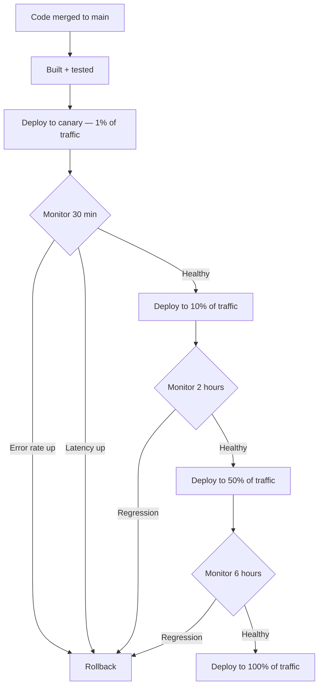

# Phase 6: CI/CD at Scale

> **In one line:** Enterprise CI/CD pipelines are themselves engineered products — distributed builds with smart caching, tests sharded across hundreds of runners, progressive delivery with automated rollback, and GitOps for Kubernetes.

:::tip[In plain English]
At a startup, CI/CD is a YAML file in your repo and the trust that your tests catch most things. At an enterprise, CI/CD is a *platform* — built by a team of engineers, run on dedicated infrastructure, processing tens of thousands of builds per day. A 4-hour test suite has to finish in 8 minutes, or developers can't ship at the company's pace.

The point of all this engineering investment: turn "code merged to main" into "code safely in front of users" without a human ever touching a deploy button.
:::

## Distributed builds

- Tools like Bazel that cache build artifacts.
- BuildBuddy, Turborepo Remote Cache, EngFlow for remote build caching.
- A 4-hour sequential build runs in 8 minutes parallel + cached.

The math is dramatic: when 100 PRs land per day and each one rebuilds everything from scratch, your build farm becomes the bottleneck of the whole engineering org. Remote caching means "if anyone in the company has built this file already, you get their result." Suddenly the build farm is back under control.

## Test sharding

- Tests split across hundreds of parallel runners.
- Smart test selection: only run tests affected by changes.

A million-test suite isn't a problem when you can spread it across 500 runners. The catch is keeping the tests fast and the sharding logic correct.

## Build orchestration

- Jenkins, Buildkite, CircleCI, custom systems.
- Tens of thousands of builds per day.

The orchestrator's job: hand work to runners, retry transient failures, surface results to engineers, and not catch fire when 200 engineers all push at once.

## Progressive delivery

**Progressive delivery** is the practice of rolling new code out to a tiny slice of users first, watching the metrics, and only widening the rollout if everything looks healthy. The initial sliver is called a **canary** (after the bird in coal mines).

A typical canary pipeline:

Automated rollback on **SLO** (Service Level Objective — a numeric target like "99.9% of requests succeed in under 200ms") regression is standard at this scale. The deploy system *itself* watches the metrics and reverts the change if anything looks wrong — no human in the loop required.

:::info[Highlight: deploy != release]
At enterprise scale, you split *deploying* (code is on production servers) from *releasing* (users see new behavior). Feature flags make this possible.

That separation is enormously freeing: you can deploy ten times a day, each one a small safe change, and *release* features whenever marketing is ready. Catastrophic releases stop being a thing because you can flip the flag back without redeploying anything.
:::

## GitOps

- Argo CD or Flux manages Kubernetes deployments.
- Git repo is the source of truth for what's deployed.
- Changes to infrastructure go through code review like any other change.

The GitOps insight: the cluster's desired state should be *declarative*, *versioned*, and *reviewed* — just like application code. Every deploy is a Git commit; every rollback is `git revert`.

:::note[Worked example: rollback during a canary]
A bad commit lands in main. Here's what should happen:

1. **00:00** — Build passes; canary deploy starts (1% of traffic).
2. **00:03** — Canary's error rate climbs from 0.1% to 4.7%.
3. **00:04** — Automated rollback triggers (Argo CD reverts the manifest to the previous version).
4. **00:05** — Canary returns to healthy.
5. **00:06** — Author gets a Slack alert: "Your change was auto-rolled-back. See dashboard."

Total user impact: 1% of users for 4 minutes. The whole thing happens before anyone is paged. The author wakes up, sees the alert, debugs the issue calmly, and tries again the next day.

At a startup, the same scenario plays out at 100% of users for 45 minutes until someone notices. The engineering investment in canary deploys and auto-rollback is what turns hours of customer pain into minutes for a tiny slice of traffic.
:::

## What's next

→ Continue to [Phase 7: Deployment & Infrastructure](./deployment) — what's actually running once the CD pipeline ships your code.
