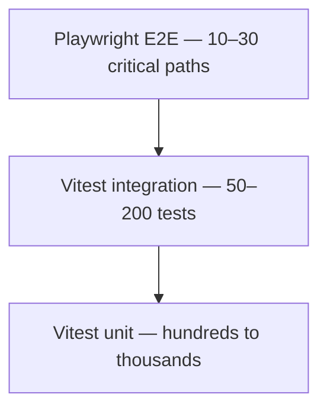

# Phase 7: Testing Strategy

> **In one line:** Hundreds of Vitest unit tests, dozens of integration tests, a handful of Playwright E2E tests on the critical flows, and manual QA for the rest. Test what would break the business if it failed.

:::tip[In plain English]
The cliché "test pyramid" is real — lots of cheap unit tests, fewer mid-sized integration tests, very few expensive E2E tests. The mistake startups make isn't picking the wrong tools (Vitest and Playwright are basically standard); it's either skipping tests entirely or chasing a 90% coverage target that produces a thousand brittle tests nobody trusts.
:::

## The testing pyramid

A pragmatic testing pyramid — cheap fast tests at the bottom, expensive realistic tests at the top:



The shape matters: each layer above is roughly an order of magnitude more expensive to run and harder to keep stable, so you want most of your coverage to come from the base.

## Unit tests (Vitest)

- Pure business logic.
- Validation functions.
- Utility functions.
- Component rendering for shared UI library.

```typescript
import { describe, it, expect } from 'vitest';
import { calculateInvoiceTotal } from './invoice';

describe('calculateInvoiceTotal', () => {
  it('applies tax to subtotal', () => {
    const result = calculateInvoiceTotal({
      items: [{ price: 100, quantity: 2 }],
      taxRate: 0.08,
    });
    expect(result).toEqual({ subtotal: 200, tax: 16, total: 216 });
  });

  it('handles empty items', () => {
    const result = calculateInvoiceTotal({ items: [], taxRate: 0.08 });
    expect(result).toEqual({ subtotal: 0, tax: 0, total: 0 });
  });
});
```

> **In English:** Vitest gives you `describe` (group of tests) and `it` (a single test case). Two cases here: a "happy path" with one line item and 8% tax, and an edge case (empty items list). Each test calls the function under test with crafted input and asserts the exact output via `expect(...).toEqual(...)`. No database, no network — pure logic, runs in milliseconds.

## Integration tests

- API endpoint + database.
- Server Actions with real DB.
- Webhook handlers.

Run against a test database (often a Neon branch per CI run, or a Docker Postgres).

## E2E tests (Playwright)

- Critical user flows ONLY: sign-up, sign-in, checkout, main feature path.
- 10–30 tests total, not hundreds.
- Run on CI; some teams run a subset on every push, full suite nightly.

```typescript
import { test, expect } from '@playwright/test';

test('user can sign up and complete checkout', async ({ page }) => {
  await page.goto('/signup');
  await page.fill('[name=email]', `test+${Date.now()}@example.com`);
  await page.fill('[name=password]', 'SecurePass123!');
  await page.click('button[type=submit]');
  await expect(page).toHaveURL('/dashboard');

  await page.click('text=Upgrade');
  await page.click('text=Start subscription');
  // Stripe test mode auto-fills card
  await page.frameLocator('iframe[name^="__privateStripeFrame"]')
    .locator('[name=cardnumber]').fill('4242 4242 4242 4242');
  // ... rest of checkout
  await page.click('text=Subscribe');
  await expect(page.locator('text=Subscription active')).toBeVisible();
});
```

> **In English:** Playwright drives a real browser. This single test walks the most expensive critical path: sign up with a unique email (the `Date.now()` trick avoids collisions across runs), confirm you land on the dashboard, click into upgrade, fill the Stripe iframe with a test card (`4242 4242 4242 4242` is Stripe's universal "approves" card in test mode), and assert the subscription-active confirmation appears. If any link in this chain breaks, the test fails — which is exactly the chain you cannot afford to break in production.

## Manual QA

- The PM or designer clicks through new features before merge.
- For larger changes, a "QA day" before release.
- No dedicated QA team yet at this scale.

## Coverage targets

- No formal target (e.g., not "80% coverage required").
- Focus on testing what would break the business if it failed.
- Critical paths (payment, auth, data integrity) should have multiple test layers.

:::note[Worked example: which tests to write for a new feature]
You're adding bulk export. What gets tested at each layer?

- **Unit (Vitest):** The CSV-formatting function (input rows → string). Edge cases: empty list, special characters that need escaping, null fields. Five tests.
- **Integration:** The Server Action that fetches rows, calls the formatter, uploads to R2, returns a signed URL. Two tests: happy path, and "user has no rows."
- **E2E (Playwright):** *Skip.* This isn't a critical path. If the export breaks in production, users are inconvenienced but the business survives. Sentry will catch errors.

The discipline: don't reach for E2E by default. Most features don't earn one.
:::

:::info[Highlight: coverage isn't the goal]
A team chasing 90% coverage will write tests for trivial getters, throwaway components, and edge cases nobody will hit. The result: a thousand tests, a slow CI, and a false sense of security.

The actual goal is: *would I sleep through the night with the current test suite?* That depends on the critical paths — payments work, auth works, data isn't lost. Test those exhaustively. Test most other code lightly. Skip the rest.
:::

## Common mistakes

:::caution[Where people commonly trip up]
- **Mocking the database in "integration" tests.** A test that mocks Drizzle, the HTTP layer, and Stripe isn't integration — it's a unit test wearing a costume, asserting that your mocks match the mocks you wrote. Run integration tests against a real Postgres (Neon branch or Docker) or skip the layer entirely.
- **Tolerating flaky E2E tests.** A test that fails 1 in 10 runs gets re-run until green, and the team learns to mistrust CI. Quarantine flaky tests within 24 hours of the first flake; fix or delete within a week. A small reliable E2E suite beats a large unreliable one.
- **Writing tests *after* the code is already in production.** Backfilling tests for a feature that's already live almost never happens. If a feature is risky enough to test, write the test in the same PR — otherwise the test debt just accumulates.
- **Skipping tests entirely on "internal-only" tools.** Admin dashboards and internal scripts touch the same production data as the public app. A buggy admin delete is just as destructive as a buggy customer one. Test the critical paths regardless of who uses them.
- **Confusing "the test passes" with "the feature works."** A green checkout test that doesn't actually verify a charge in Stripe's test mode is a vanity metric. Assert the side effect you care about (a `succeeded` Stripe event, a row in the DB) — not just that no exception was thrown.
:::

## Page checkpoint

<Quiz id="startup-testing-page" title="Did the testing strategy stick?" sampleSize={2}>

<Question
  prompt="What shape does the page recommend for the test suite at startup scale?"
  options={[
    { text: "Mostly E2E tests, with a handful of unit tests" },
    { text: "Roughly equal numbers across unit, integration, and E2E" },
    { text: "Hundreds of unit tests, dozens of integration tests, only 10-30 E2E tests on critical flows" },
    { text: "100% coverage on every layer" }
  ]}
  correct={2}
  explanation="The pyramid: hundreds to thousands of cheap fast unit tests, 50-200 integration tests, and only 10-30 Playwright E2E tests for the critical paths. Each layer up is roughly 10x more expensive."
  revisit={{ to: "/docs/startup/testing#the-testing-pyramid", label: "Testing pyramid" }}
/>

<Question
  prompt="What does the page say about formal coverage targets like 80% or 90%?"
  options={[
    { text: "They are required for any production code" },
    { text: "Chasing them produces brittle tests nobody trusts; focus on what would break the business if it failed" },
    { text: "They should be enforced by CI and block merges" },
    { text: "They are the most important metric for engineering health" }
  ]}
  correct={1}
  explanation="The page rejects formal coverage targets at this scale. The actual question is would you sleep through the night with the current suite — which depends on critical paths (payments, auth, data integrity) being well-tested, not on a percentage."
  revisit={{ to: "/docs/startup/testing#coverage-targets", label: "Coverage targets" }}
/>

<Question
  prompt="When does the page recommend reaching for a Playwright E2E test on a new feature?"
  options={[
    { text: "For every new feature, by default" },
    { text: "Only for critical user flows whose failure would meaningfully harm the business" },
    { text: "Only when manual QA refuses to test the feature" },
    { text: "Never — E2E tests are too flaky to be useful" }
  ]}
  correct={1}
  explanation="The worked example explicitly skips E2E for a bulk export. E2E is reserved for flows like sign-up, sign-in, and checkout — paths where breakage in production is a real business problem."
  revisit={{ to: "/docs/startup/testing#e2e-tests-playwright", label: "When to write E2E" }}
/>

<Question
  prompt="Where do integration tests in this stack typically run, per the page?"
  options={[
    { text: "Against production with a special test tenant" },
    { text: "Against a test database — often a Neon branch per CI run, or a Docker Postgres" },
    { text: "Against an in-memory SQLite mock, never real Postgres" },
    { text: "On the engineer's laptop only, not in CI" }
  ]}
  correct={1}
  explanation="Integration tests exercise API endpoints and Server Actions with the real database. They run against a test database — commonly a Neon branch spun up per CI run or a Docker Postgres."
  revisit={{ to: "/docs/startup/testing#integration-tests", label: "Integration tests" }}
/>

</Quiz>

## What's next

→ Continue to [Phase 8: CI/CD](./cicd) where GitHub Actions ties the testing strategy to the deploy pipeline.
