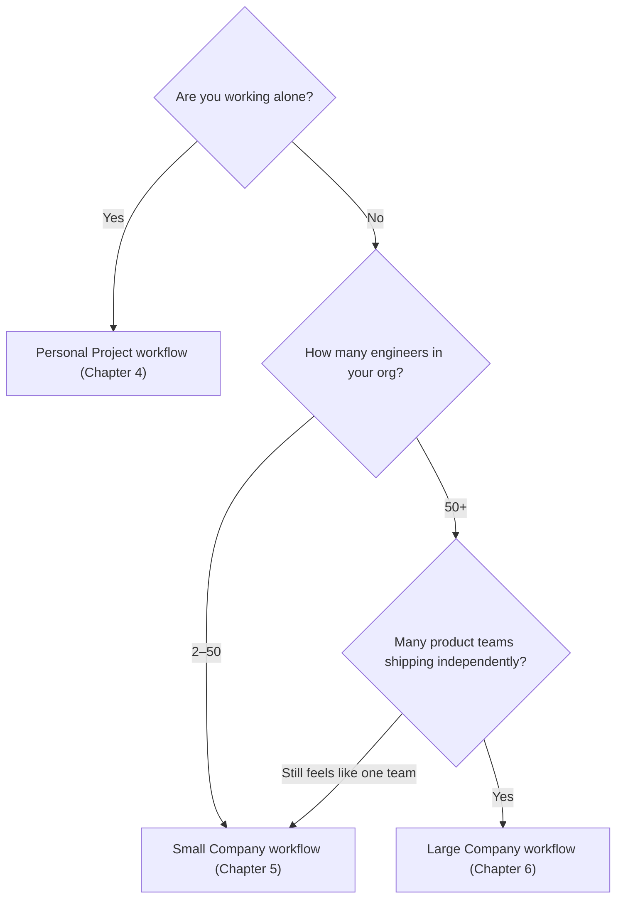

# Part 7: Side-by-Side Comparison

*Quick-reference tables showing how all three scales differ across every dimension.*

:::tip[Beginner orientation]
**How to read this chapter:** Each table shows the same dimension (e.g., "How do they deploy code?") at three scales — solo, startup, enterprise. Reading them side-by-side is the fastest way to grasp how engineering culture changes with team size.

**The big takeaway in advance:** There is no single "correct" way to build software. What's reasonable at one scale is absurd at another. Kubernetes is overkill for a personal blog. A laptop deploy is unacceptable for a bank. The skill is matching tooling to context.

**If you're choosing a stack for a new project:** Find the row for your situation in each table and use those choices as your default.

**If you only remember one thing:** Engineering choices are scale-dependent. Don't copy a FAANG company's setup for your weekend project, and don't bring a weekend setup into an enterprise.
:::

This chapter is a reference. Skim it when you need a quick mental model of how a specific aspect (team structure, hosting, testing, etc.) differs across scales.

## At-a-Glance Comparison

| Aspect              | Personal              | Small Company           | Large Company                      |
|---------------------|-----------------------|-------------------------|------------------------------------|
| **Team size**       | 1                     | 2–50                    | 500–10,000+                        |
| **Time horizon**    | Weeks                 | 12–18 months            | 3–5 years                          |
| **Optimize for**    | Speed of shipping     | Speed + scalability     | Reliability + security + compliance |
| **Cost concern**    | Free tier maximization| Cost vs value           | FinOps as a discipline             |
| **Process**         | Almost none           | Lightweight             | Extensive, formal                  |
| **Risk tolerance**  | High (it's just yours)| Medium                  | Low (real consequences)            |
| **Stack churn**     | Whenever you want     | Stable for 1–2 years    | Multi-year stability               |
| **Cross-team coordination** | None         | Sometimes               | Constant                           |

:::info[Highlight: choosing your workflow]
Where do you sit?

The transitions are gradual. You don't wake up one morning and suddenly need **Kubernetes** (an open-source system that automates deploying, scaling, and managing containerized apps across a cluster of machines). Adopt practices as their cost is justified by your scale.
:::

## How this chapter is organized

Each page is a focused comparison across one or two related dimensions:

1. [Team and Process](/docs/comparison/team-and-process) — Team structure, decision-making, and hiring.
2. [Stack and Hosting](/docs/comparison/stack-and-hosting) — Architecture, languages, and where things run.
3. [Development](/docs/comparison/development) — Workflow, testing, and CI/CD.
4. [Operations](/docs/comparison/ops) — Observability and security/compliance.
5. [Economics](/docs/comparison/economics) — Cost profile and time-to-production.
6. [Trade-Offs](/docs/comparison/tradeoffs) — Characteristic trade-offs and career implications at each scale.

## Wrapping up in advance

These comparisons aren't normative — there's no "right" scale. Each works well for its context. The skill is recognizing your scale and applying appropriate practices.

The biggest mistake is **applying the wrong scale's practices**:

- Personal project with enterprise process: nothing ships.
- Enterprise with personal-project practices: chaos.
- Small company with personal-project practices: chaos.
- Small company with enterprise practices: glacial.

---

When you finish, move on to [Chapter 8: Decision Frameworks](/docs/decisions).
