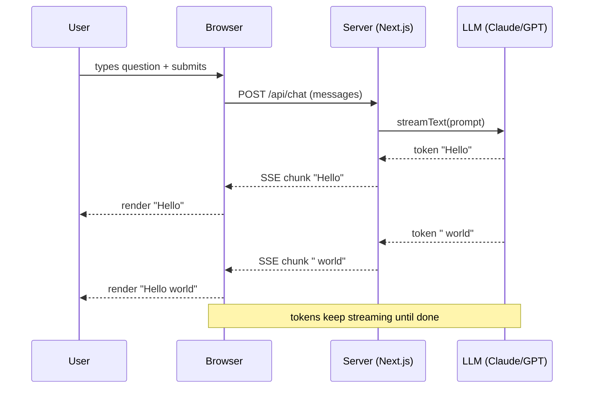

# Pattern 1: Streaming Chat

> **In one line:** A chat interface where the user types and the assistant responds token-by-token over Server-Sent Events — the most common AI pattern in modern web apps.

:::tip[In plain English]
A 3-second response *streamed* feels fast. The same response delivered as a single chunk feels slow. Streaming is a UX trick — the model isn't actually faster, but the user sees progress immediately. In 2026 nearly every chat-style AI feature uses it.
:::

The most common pattern in modern web apps: a chat interface where the user types and the assistant responds.

## The setup

The user sees responses appear token-by-token, which is essential for perceived speed (a 3-second response feels fast streamed; the same response delivered as a chunk feels slow).



> **Jargon:** A **token** is the unit the model produces — usually a short piece of a word, on average ~4 characters of English text. **SSE (Server-Sent Events)** is a one-way HTTP streaming protocol where the server keeps the connection open and pushes chunks as it generates them.

## Implementation with Vercel AI SDK

The Vercel AI SDK is the dominant TypeScript abstraction for AI in 2026. It handles streaming, message history, tool calling, and provider switching.

**Server side (Next.js Route Handler):**

```typescript
// app/api/chat/route.ts
import { anthropic } from '@ai-sdk/anthropic';
import { streamText } from 'ai';

export async function POST(req: Request) {
  const { messages } = await req.json();

  const result = streamText({
    model: anthropic('claude-sonnet-4-5'),
    system: 'You are a helpful assistant for a personal finance app.',
    messages,
  });

  return result.toDataStreamResponse();
}
```

> **In English:** Read the chat history from the request body, ask Claude to continue the conversation with a fixed *system prompt* ("you are a helpful assistant for X"), and return the result as a streaming HTTP response. `toDataStreamResponse()` handles all the SSE plumbing so the client just sees tokens trickle in.

**Client side (React):**

```typescript
// app/chat/page.tsx
'use client';
import { useChat } from '@ai-sdk/react';

export default function Chat() {
  const { messages, input, handleInputChange, handleSubmit } = useChat();

  return (
    <div className="flex flex-col h-screen p-4">
      <div className="flex-1 overflow-auto space-y-4">
        {messages.map(m => (
          <div key={m.id} className={m.role === 'user' ? 'text-right' : ''}>
            <div className="inline-block bg-gray-100 rounded p-3">
              {m.content}
            </div>
          </div>
        ))}
      </div>

      <form onSubmit={handleSubmit} className="flex gap-2 mt-4">
        <input
          value={input}
          onChange={handleInputChange}
          className="flex-1 border rounded p-2"
          placeholder="Ask anything..."
        />
        <button type="submit" className="bg-blue-500 text-white px-4 py-2 rounded">
          Send
        </button>
      </form>
    </div>
  );
}
```

> **In English:** The `useChat` hook from the AI SDK manages everything — the running message list, the input field, the form submission, and the SSE stream from the server. Your component just renders messages and a form; the hook handles state and network.

That's a working chat in about 50 lines.

## The streaming protocol

Behind the scenes, the response uses **Server-Sent Events (SSE)** to stream tokens. The browser's `EventSource` (or a fetch with `ReadableStream`) receives chunks as they arrive.

Why SSE over WebSockets:

- Simpler (HTTP, not a separate protocol).
- Works with HTTP/2 multiplexing.
- Automatic reconnection in browsers.
- One-way communication is sufficient (server → client).

:::note[Worked example: why streaming is a UX trick, not a perf trick]
The model takes the same wall-clock time either way — say, 3 seconds for a 200-token response.

**Without streaming:**
- User waits 3 seconds staring at a spinner.
- Whole response appears at once.
- Perceived experience: "slow."

**With streaming:**
- First token arrives in ~400ms.
- Tokens trickle in for ~2.6 more seconds.
- User starts reading immediately.
- Perceived experience: "fast."

The model isn't faster. The user just isn't bored. This is why basically every chat-style AI product in 2026 streams by default.
:::

:::info[Highlight: time-to-first-token is the metric that matters]
For streamed chat, total response time is a misleading metric — users care about **time-to-first-token (TTFT)**. A 400ms TTFT feels instant; a 2-second TTFT feels broken.

Track TTFT separately from total response time. Optimize TTFT first:

- Choose models with fast TTFT (typically smaller models).
- Avoid serializing work before the stream starts (run RAG retrieval in parallel where possible).
- Stream directly from your edge or origin without buffering.
:::

## Page checkpoint

<Quiz id="ai-streaming-chat-page" title="Did streaming chat stick?" sampleSize={2}>

<Question
  prompt="Why does streaming a 3-second LLM response feel faster than waiting 3 seconds for a single chunk?"
  options={[
    { text: "Streaming makes the model produce tokens faster overall" },
    { text: "Streaming compresses tokens so fewer bytes travel the network" },
    { text: "The model is unchanged — streaming just lets the user read while tokens arrive, which lowers perceived wait" },
    { text: "Streaming triggers a different, lower-latency model under the hood" }
  ]}
  correct={2}
  explanation="Total wall-clock time is the same. Streaming is a UX trick: as soon as the first token arrives the user starts reading, so they never sit watching a spinner."
  revisit={{ to: "/docs/ai/ai-streaming-chat#the-setup", label: "Why streaming feels fast" }}
/>

<Question
  prompt="Which metric matters most for chat-style streaming UX?"
  options={[
    { text: "Total response time" },
    { text: "Tokens per second once the stream is going" },
    { text: "Time-to-first-token (TTFT)" },
    { text: "End-to-end p99 latency including retries" }
  ]}
  correct={2}
  explanation="A 400ms TTFT feels instant; a 2-second TTFT feels broken even if the full answer eventually arrives quickly. Optimize and track TTFT separately."
  revisit={{ to: "/docs/ai/ai-streaming-chat#the-streaming-protocol", label: "TTFT is the metric" }}
/>

<Question
  prompt="Why do modern chat features generally pick Server-Sent Events (SSE) over WebSockets?"
  options={[
    { text: "SSE is faster than WebSockets on every benchmark" },
    { text: "Only SSE supports binary frames" },
    { text: "Token streaming is server-to-client only, and SSE is plain HTTP with automatic reconnection" },
    { text: "WebSockets do not work behind HTTPS" }
  ]}
  correct={2}
  explanation="The model only needs to push tokens to the browser, so a one-way HTTP stream is sufficient — and SSE composes with HTTP/2, proxies, and browser auto-reconnect."
  revisit={{ to: "/docs/ai/ai-streaming-chat#the-streaming-protocol", label: "SSE vs WebSockets" }}
/>

<Question
  prompt="In the Vercel AI SDK example, what does the server's `toDataStreamResponse()` do?"
  options={[
    { text: "Buffers all tokens and returns one JSON blob at the end" },
    { text: "Returns an HTTP response that streams tokens over SSE so the client's useChat hook can render incrementally" },
    { text: "Opens a WebSocket to the browser" },
    { text: "Sends the response to a queue for background processing" }
  ]}
  correct={1}
  explanation="It wires the model's token stream onto an SSE-style HTTP response. The client's useChat hook reads chunks and appends them to the rendered message as they arrive."
  revisit={{ to: "/docs/ai/ai-streaming-chat#implementation-with-vercel-ai-sdk", label: "Vercel AI SDK setup" }}
/>

</Quiz>

## What's next

→ Continue to [Pattern 2: Retrieval-Augmented Generation (RAG)](./ai-rag) — how to give the model access to *your* data instead of just its training data.
