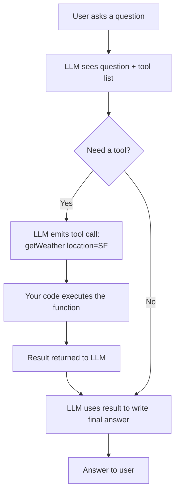

# Pattern 3: Function Calling / Structured Output

> **In one line:** Instead of producing text, the LLM picks a function to call (with arguments) or returns a JSON object that exactly matches a schema you defined.

:::tip[In plain English]
Function calling turns the LLM from "text generator" into "router" or "field extractor." You hand it a menu of tools (`getWeather`, `lookupOrder`, `sendEmail`) and it returns *which one to call with what arguments*. Structured output is the same idea for data: you give a JSON schema and the model returns conforming JSON. Both turn the unpredictable token stream into something your regular code can act on.
:::

The LLM doesn't just produce text — it calls predefined functions or returns structured data (typically JSON).

## Use cases

- **Routing.** Decide which tool/page to direct the user to.
- **Data extraction.** Pull structured fields from unstructured text (resumes, emails, contracts).
- **Action execution.** AI assistants that book meetings, send emails, query databases.
- **Form filling.** Convert natural language to form data.

## How it works

You give the LLM a list of "tools" (function signatures); it returns calls to those tools.

```typescript
import { tool } from 'ai';
import { z } from 'zod';
import { generateText } from 'ai';

const result = await generateText({
  model: anthropic('claude-sonnet-4-5'),
  prompt: 'What is the weather in San Francisco?',
  tools: {
    getWeather: tool({
      description: 'Get the current weather for a location',
      parameters: z.object({
        location: z.string().describe('City name'),
      }),
      execute: async ({ location }) => {
        const data = await fetchWeatherAPI(location);
        return { temperature: data.temp, conditions: data.summary };
      },
    }),
  },
});
```

> **In English:** You define a `getWeather` tool with a Zod schema for its arguments and an `execute` function that actually fetches the weather. When the model sees a question it can't answer from its own knowledge, it produces a structured call like `getWeather({location: "San Francisco"})`; the SDK runs your `execute`, hands the result back to the model, and the model writes a natural-language reply using it.

The flow:



1. User asks a question.
2. LLM decides it needs the `getWeather` tool.
3. LLM returns: `getWeather({ location: 'San Francisco' })`.
4. Your code executes the function.
5. The result is sent back to the LLM.
6. LLM uses the result to answer the user.

## Structured output

When you want JSON in a specific shape:

```typescript
import { generateObject } from 'ai';
import { z } from 'zod';

const result = await generateObject({
  model: anthropic('claude-sonnet-4-5'),
  schema: z.object({
    title: z.string(),
    summary: z.string(),
    tags: z.array(z.string()).max(5),
    sentiment: z.enum(['positive', 'neutral', 'negative']),
  }),
  prompt: `Analyze this article:\n\n${articleText}`,
});

// result.object is fully typed!
console.log(result.object.title);
```

> **In English:** Instead of getting back free-form text, you describe the shape you want (with **Zod**, a TypeScript schema library), and `generateObject` makes the model return JSON that matches it — already parsed, already validated, and typed in TypeScript. You can use the result directly without `JSON.parse` or runtime checks.

The SDK enforces the schema; you get type-safe, validated output.

## Critical: always validate

Even when the LLM "should" return valid output, validate anyway:

```typescript
import { z } from 'zod';

const ExpectedShape = z.object({
  name: z.string(),
  age: z.number().int().min(0).max(150),
});

try {
  const validated = ExpectedShape.parse(llmOutput);
  // Safe to use
} catch (err) {
  // Log, retry, or fall back
}
```

LLMs occasionally violate their instructions. Validation is your safety net.

:::note[Worked example: extracting structured data from email]
A team automates support triage. They want incoming emails turned into a structured object their existing ticket system understands.

```typescript
const ticketSchema = z.object({
  category: z.enum(['billing', 'bug', 'feature_request', 'other']),
  urgency: z.enum(['low', 'medium', 'high']),
  summary: z.string().max(120),
  customerSentiment: z.enum(['frustrated', 'neutral', 'positive']),
});

const result = await generateObject({
  model: anthropic('claude-haiku-4-5'), // cheap is fine here
  schema: ticketSchema,
  prompt: `Classify this support email:\n\n${email.body}`,
});

await ticketSystem.create({
  customerId: email.from,
  ...result.object, // strictly typed
});
```

What used to be a human reading every email is now a $0.0003 model call that produces a strictly-typed object. The schema validation guarantees the downstream ticket system doesn't choke on a surprise field.
:::

:::info[Highlight: structured output as a safety boundary]
Even if you "trust" the LLM, validate. LLMs occasionally:

- Omit required fields.
- Return strings where numbers were requested.
- Generate enum values that aren't in the schema.
- Add extra fields you didn't ask for.

The Zod (or Pydantic) `.parse()` call is your boundary between the unpredictable model output and the rest of your application — treat it like input validation on a public API endpoint.
:::

## Common mistakes

:::caution[Where people commonly trip up]
- **Vague or missing tool descriptions.** A tool named `getData` with no description leaves the model guessing when to call it. Treat the description and parameter descriptions like docstrings for a junior dev — what does it do, when should it be used, what does it return? That text is the prompt for the routing decision.
- **Auto-executing destructive tools.** Wiring `deleteUser` or `sendEmail` directly into `tools` and letting the SDK run them with no confirmation step is how prompt injection turns into real damage. Require explicit user approval — or a separate non-AI policy check — for any tool with side effects.
- **Skipping `.parse()` because "structured output is guaranteed."** Even with native structured output, models occasionally drop required fields, emit out-of-range numbers, or invent enum values. The Zod/Pydantic parse at the boundary is non-negotiable; treat it like input validation on a public API.
- **Picking a frontier model for a classification task.** Routing into 4 enum buckets doesn't need Opus 4.7. Use Haiku 4.5 or GPT-4.1-mini for bounded extraction/classification and reserve frontier models for genuinely open-ended reasoning — easy 10-30x cost cut with no measurable quality loss.
- **No retry on a schema-validation failure.** When `.parse()` throws, dumping a 500 to the user is worse than asking the model to try again with the validation error in the prompt. Build a single-retry path that feeds the Zod error back as a corrective message.
:::

## Page checkpoint

<Quiz id="ai-function-calling-page" title="Did function calling stick?" sampleSize={2}>

<Question
  prompt="Conceptually, what does function calling turn the LLM into?"
  options={[
    { text: "A faster code generator that emits final production code" },
    { text: "A router or field extractor — it picks which tool to invoke (with what arguments) instead of producing free-form text" },
    { text: "A database that stores tool definitions" },
    { text: "A replacement for input validation libraries" }
  ]}
  correct={1}
  explanation="You hand the model a menu of tools with typed arguments. Its output is a structured choice — 'call getWeather with location=SF' — which your regular code then executes."
  revisit={{ to: "/docs/ai/ai-function-calling#how-it-works", label: "How tool calling works" }}
/>

<Question
  prompt="What's the main benefit of `generateObject` with a Zod schema over asking the model for JSON in plain text?"
  options={[
    { text: "It uses a cheaper model automatically" },
    { text: "You get parsed, validated, type-safe output — no manual JSON.parse or shape checking" },
    { text: "It bypasses the LLM entirely for structured tasks" },
    { text: "It avoids the need for an API key" }
  ]}
  correct={1}
  explanation="generateObject pairs schema enforcement with parsing. You skip the brittle 'JSON.parse and hope' step and the result is already typed in TypeScript."
  revisit={{ to: "/docs/ai/ai-function-calling#structured-output", label: "generateObject + Zod" }}
/>

<Question
  prompt="Even when using structured output, why should you still call `.parse()` on the LLM's response?"
  options={[
    { text: "Zod is slow without it" },
    { text: "Models occasionally drop fields, swap types, or invent enum values; .parse() is your boundary check" },
    { text: "It is required by the OpenAI terms of service" },
    { text: "It converts the output from JSON to CSV" }
  ]}
  correct={1}
  explanation="LLMs are non-deterministic. Treat the model's output like input from a public API — validate at the boundary before letting it flow into the rest of your app."
  revisit={{ to: "/docs/ai/ai-function-calling#critical-always-validate", label: "Always validate model output" }}
/>

<Question
  prompt="In the support-email triage worked example, why is a cheap (Haiku-class) model fine?"
  options={[
    { text: "Cheap models are always more accurate at classification" },
    { text: "The task is constrained classification into a small enum, not open-ended reasoning — small models do this well at a fraction of the cost" },
    { text: "Haiku is the only model that supports Zod schemas" },
    { text: "Cheap models never hallucinate" }
  ]}
  correct={1}
  explanation="Routing/classification into a fixed shape is exactly the kind of bounded task small models are good at. Pay for frontier reasoning only where you actually need it."
  revisit={{ to: "/docs/ai/ai-function-calling#structured-output", label: "Pick model tier by task" }}
/>

</Quiz>

## What's next

→ Continue to [Pattern 4: Agentic Workflows](./ai-agents) — let the model plan and execute multi-step tasks.
