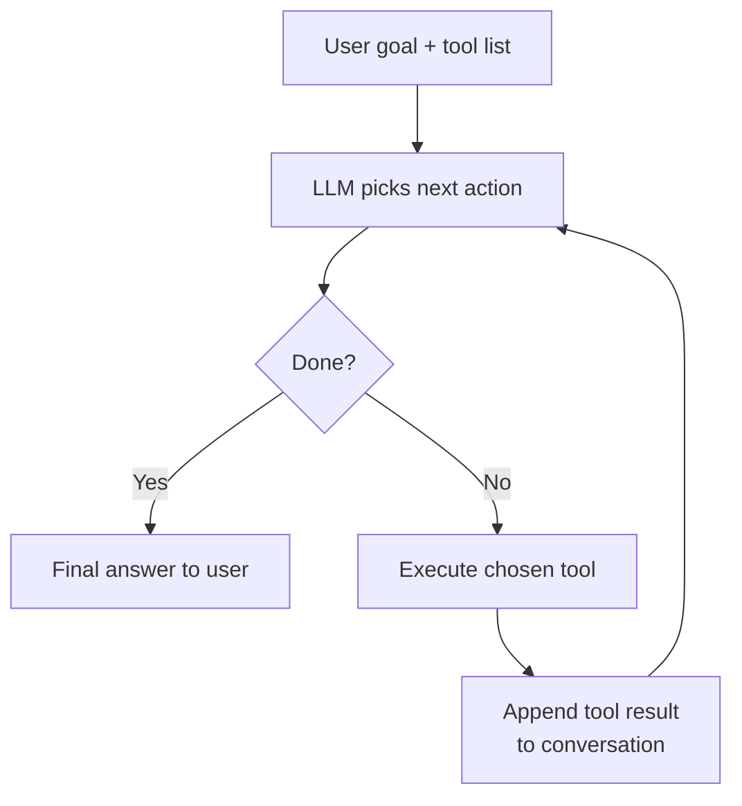

# Pattern 4: Agentic Workflows

> **In one line:** An agent is an LLM that picks a tool, observes the result, picks the next tool, and keeps going until it decides the task is done — multi-step reasoning over a sandbox of capabilities.

:::tip[In plain English]
Function calling lets the model call *one* tool. An agent lets it loop: call a tool, see the output, decide whether to call another, and so on. This is what powers Claude Code, Cursor, customer-support agents, and research assistants. The cost: many LLM calls per task, longer latency, and a much higher need for careful guardrails because the agent is autonomously taking actions.
:::

The LLM plans a sequence of steps, executes them, and adjusts based on results. "Agents."

## Simple agent loop

In words:

1. LLM receives task + available tools.
2. LLM decides next action (call a tool, or finish).
3. Tool is executed; result returned.
4. LLM sees the result, decides next action.
5. Repeat until LLM signals completion.

> **Jargon:** This is what people mean by *agentic* — the model is in a loop, picking its own next step instead of being driven by a fixed script. **Tool calls** are the agent's only way to affect the outside world (read a file, call an API, write to a DB).

## Example use cases

- **Coding agents.** Read code, edit files, run tests, iterate (Claude Code, Cursor compose, Devin).
- **Research agents.** Search the web, read pages, synthesize findings.
- **Customer support agents.** Look up account, check policy, take action, draft response.
- **Sales/CRM agents.** Update records based on email content.
- **Operations agents.** Diagnose incidents, run runbooks.

## Implementation tools

- **Vercel AI SDK** with tool calling — sufficient for simple agents.
- **LangChain.js** — More elaborate agent patterns.
- **LangGraph** — State-machine-based agent orchestration.
- **Inngest / Trigger.dev** — Durable execution (agents that survive crashes).
- **Temporal** — Heavy-duty workflow orchestration.

## Agent challenges

**Cost.** Agents make many LLM calls. A complex task might cost $5–50.

**Latency.** A 10-step agent can take 1–5 minutes. Users need to see progress.

**Reliability.** Each step has failure modes. Errors compound.

**Safety.** Agents that take real actions (send emails, modify databases) need careful sandboxing.

**Debugging.** When an agent fails, you need traces of every step and decision.

## When agents make sense

- The task is genuinely multi-step.
- Each step requires reasoning about prior results.
- Manual completion is expensive enough to justify agent cost.

When they don't:

- Single-step tasks (just call the LLM once).
- Tasks with deterministic answers (use a script).
- Latency-critical user interactions.

In 2026, agentic workflows are increasingly viable but still require careful engineering. The best are heavily scaffolded — strict tool definitions, validation at every step, clear success criteria, monitoring.

:::note[Worked example: a research agent in action]
A user asks a research agent: "What's the current sentiment about our latest product launch on social media?"

The agent's actual trace:

1. **Tool call:** `searchTwitter({ query: "Acme Launch 2026" })` → 50 tweets.
2. **Tool call:** `searchReddit({ query: "Acme Launch 2026" })` → 12 posts.
3. **Tool call:** `searchHackerNews({ query: "Acme Launch 2026" })` → 3 threads.
4. **Reasoning step:** Group by source, summarize tone.
5. **Tool call:** `classifySentiment(...)` on a sample.
6. **Final answer:** "Mostly positive (~70%), with criticism focused on the pricing of the Pro tier."

Total: 6 LLM calls, ~$0.15 in API costs, ~45 seconds of wall-clock time. A human doing the same task: ~45 minutes. Costs justify themselves at any scale — but you needed to *measure* both sides to know that.
:::

:::info[Highlight: every agent needs a kill switch]
Agents that take real-world actions (sending emails, modifying databases, spending money) can compound errors quickly. A bug that causes the agent to retry the same action 50 times can produce 50 duplicate charges, 50 wrong emails, or 50 corrupted records.

Non-negotiable guardrails:

- **Hard limit on tool-call count** per task (e.g., 25).
- **Spending limit** per task (cancel if it exceeds budget).
- **Human approval** for high-impact actions (sending external emails, payments, deletions).
- **Full audit trace** of every step for debugging.
- **Easy kill switch** to stop the agent mid-run.

Without these, an agent that worked in dev can cost real money in production.
:::

## Common mistakes

:::caution[Where people commonly trip up]
- **No hard cap on the loop.** An agent stuck in a "search → didn't find it → search again" cycle will happily burn 200 LLM calls before you notice. Enforce a max-step counter *and* a max-spend counter in the loop itself — not just a timeout — and fail loudly when either trips.
- **Shipping the agent straight to prod with no traces.** When the agent does something weird on step 12, you need the full sequence of prompts, tool calls, and observations to debug it. Wire Langfuse (or your tracer of choice) on day one — debugging an untraced agent is essentially guesswork.
- **Letting the agent's tools touch production directly in dev.** An agent prototype that can `sendEmail` or `chargeCard` against the live system *will* eventually do something embarrassing during a test run. Run agents against a sandbox or a `dryRun: true` mode until guardrails and evals are in place.
- **Confusing "agentic" with "good fit."** A lot of "agents" in 2026 are really a fixed 3-step pipeline dressed up in a loop. If the steps are knowable in advance, write a deterministic workflow — it's cheaper, faster, and easier to debug. Reserve real agents for tasks where the next step genuinely depends on prior results.
- **No human-in-the-loop for high-impact actions.** "The model is smart enough" is not a guardrail. Any external email, payment, deletion, or production write should require explicit user confirmation — implemented in regular code, not by asking the model nicely.
:::

## Page checkpoint

<Quiz id="ai-agents-page" title="Did agentic workflows stick?" sampleSize={2}>

<Question
  prompt="What separates an 'agent' from a single function-calling request?"
  options={[
    { text: "Agents use a different model family than function calling" },
    { text: "An agent loops — call a tool, observe the result, pick the next tool, repeat — until it decides the task is done" },
    { text: "Agents always run in the background; function calls are synchronous" },
    { text: "Agents don't return text, only JSON" }
  ]}
  correct={1}
  explanation="Function calling is a single tool decision. Agents put that decision in a loop where each step's output feeds the next step's reasoning."
  revisit={{ to: "/docs/ai/ai-agents#simple-agent-loop", label: "The agent loop" }}
/>

<Question
  prompt="Which scenario is the WORST fit for an agentic workflow?"
  options={[
    { text: "A multi-step research task across several APIs that requires reasoning about each result" },
    { text: "A coding assistant that reads files, edits them, runs tests, and iterates" },
    { text: "Looking up a user's most recent invoice in a synchronous web request with a 1-second SLO" },
    { text: "Diagnosing an incident by running runbooks step by step" }
  ]}
  correct={2}
  explanation="Agents are slow and expensive — many LLM calls per task. For deterministic single-step lookups inside a tight latency budget, just call the DB (or a single LLM call) directly."
  revisit={{ to: "/docs/ai/ai-agents#when-agents-make-sense", label: "When agents fit (and don't)" }}
/>

<Question
  prompt="A team is shipping an agent that can send external emails on behalf of users. What's the most important guardrail?"
  options={[
    { text: "Use the largest available model for accuracy" },
    { text: "Hard limits on tool-call count and a kill switch, plus human approval for high-impact actions like external emails" },
    { text: "Disable streaming so users can't interrupt the agent" },
    { text: "Skip logging to keep response times low" }
  ]}
  correct={1}
  explanation="Agents compound errors fast. A bug that loops the same action 50 times can produce 50 bad emails. Tool-call caps, spend caps, human approval for high-impact actions, and an audit trace are non-negotiable."
  revisit={{ to: "/docs/ai/ai-agents#agent-challenges", label: "Every agent needs a kill switch" }}
/>

<Question
  prompt="Why is debugging a flaky agent harder than debugging a normal HTTP service?"
  options={[
    { text: "Agents don't produce HTTP logs at all" },
    { text: "Each step is a non-deterministic LLM decision, so you need traces of every prompt, tool call, and result to reconstruct what the agent did" },
    { text: "Agents only run on serverless platforms that hide logs" },
    { text: "Agents always run in parallel, so logs interleave randomly" }
  ]}
  correct={1}
  explanation="When an agent fails on step 7, you need to see steps 1-6 — the prompts, the tool calls, and their outputs — to understand why it made the choice it did. Without traces, every bug is a guessing game."
  revisit={{ to: "/docs/ai/ai-agents#agent-challenges", label: "Why agents need traces" }}
/>

</Quiz>

## What's next

→ Continue to [Pattern 5: Embeddings for Semantic Search](./ai-embeddings) — embeddings power more than just RAG.
