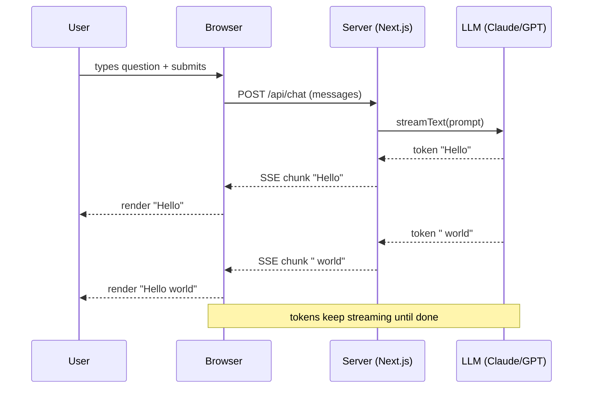

# Pattern 1: Streaming Chat

> **In one line:** A chat interface where the user types and the assistant responds token-by-token over Server-Sent Events — the most common AI pattern in modern web apps.

:::tip[In plain English]
A 3-second response *streamed* feels fast. The same response delivered as a single chunk feels slow. Streaming is a UX trick — the model isn't actually faster, but the user sees progress immediately. In 2026 nearly every chat-style AI feature uses it.
:::

The most common pattern in modern web apps: a chat interface where the user types and the assistant responds.

## The setup

The user sees responses appear token-by-token, which is essential for perceived speed (a 3-second response feels fast streamed; the same response delivered as a chunk feels slow).



> **Jargon:** A **token** is the unit the model produces — usually a short piece of a word, on average ~4 characters of English text. **SSE (Server-Sent Events)** is a one-way HTTP streaming protocol where the server keeps the connection open and pushes chunks as it generates them.

## Implementation with the AI SDK

The Vercel AI SDK is the dominant TypeScript abstraction for AI in 2026. It handles streaming, message history, tool calling, and provider switching.

:::note[Version stamp: AI SDK 5 — as of mid-2026]
The code below targets **AI SDK 5** (the breaking release that landed in 2025). If you read an older tutorial, the shape is different — see the "what changed since v4" box after the example so you can recognize stale code. The *concepts* (stream tokens over SSE, a hook drives the UI) are durable; the exact function names move.
:::

The SDK splits messages into two typed shapes, and this distinction is the thing to internalize:

> **Jargon:** A **`UIMessage`** is the rich object your UI holds — id, role, and a `parts` array (text parts, tool-call parts, file parts, reasoning parts). A **`ModelMessage`** is the trimmed shape the model actually needs. You render `UIMessage`s; you send `ModelMessage`s to the model. `convertToModelMessages()` bridges them.

**Server side (Next.js Route Handler):**

```typescript
// app/api/chat/route.ts
import { anthropic } from '@ai-sdk/anthropic';
import { streamText, convertToModelMessages, type UIMessage } from 'ai';

export async function POST(req: Request) {
  const { messages }: { messages: UIMessage[] } = await req.json();

  const result = streamText({
    model: anthropic('claude-sonnet-4-5'),
    system: 'You are a helpful assistant for a personal finance app.',
    messages: convertToModelMessages(messages),
  });

  return result.toUIMessageStreamResponse();
}
```

> **In English:** Read the chat history (an array of `UIMessage`s) from the request body, convert it to the slimmer `ModelMessage` shape the model wants, ask Claude to continue with a fixed *system prompt* ("you are a helpful assistant for X"), and return the result as a streaming HTTP response. `toUIMessageStreamResponse()` handles all the SSE plumbing *and* re-encodes the stream as typed `UIMessage` parts so the client renders them directly.

**Client side (React):**

```typescript
// app/chat/page.tsx
'use client';
import { useState } from 'react';
import { useChat } from '@ai-sdk/react';

export default function Chat() {
  // In AI SDK 5, useChat NO LONGER manages the input — you own it.
  const [input, setInput] = useState('');
  const { messages, sendMessage } = useChat();

  return (
    <div className="flex flex-col h-screen p-4">
      <div className="flex-1 overflow-auto space-y-4">
        {messages.map(m => (
          <div key={m.id} className={m.role === 'user' ? 'text-right' : ''}>
            <div className="inline-block bg-gray-100 rounded p-3">
              {/* A message is a list of parts; render the text parts */}
              {m.parts.map((part, i) =>
                part.type === 'text' ? <span key={i}>{part.text}</span> : null
              )}
            </div>
          </div>
        ))}
      </div>

      <form
        onSubmit={e => {
          e.preventDefault();
          if (!input.trim()) return;
          sendMessage({ text: input });   // typed send, not handleSubmit
          setInput('');
        }}
        className="flex gap-2 mt-4"
      >
        <input
          value={input}
          onChange={e => setInput(e.target.value)}
          className="flex-1 border rounded p-2"
          placeholder="Ask anything..."
        />
        <button type="submit" className="bg-blue-500 text-white px-4 py-2 rounded">
          Send
        </button>
      </form>
    </div>
  );
}
```

> **In English:** The `useChat` hook manages the running message list and the SSE stream from the server. In AI SDK 5 it deliberately **stopped owning the input field** — you keep your own `useState` and call `sendMessage({ text })` to submit. Each message is a list of `parts` (so a single turn can mix text, a tool call, and a file); you map over the parts and render the text ones.

That's a working chat in about 50 lines.

:::caution[What changed since AI SDK v4 (so you can spot stale tutorials)]
Most pre-2025 examples will not compile against a current install. The breaking renames:

- `useChat()` **no longer returns** `input` / `handleInputChange` / `handleSubmit` — you manage input yourself and call **`sendMessage({ text })`**.
- A message's text moved from `m.content` (a string) to **`m.parts`** (a typed array). This is what makes multi-modal/tool turns first-class.
- The server one-liner `result.toDataStreamResponse()` became **`result.toUIMessageStreamResponse()`**, and you wrap incoming messages with **`convertToModelMessages()`**.

If a snippet uses `handleSubmit` or `toDataStreamResponse`, it's v3/v4 — translate it.
:::

:::info[Highlight: the frontier — AI SDK 6, Agents, and MCP (as of mid-2026)]
AI SDK **6** (released Dec 2025) is the current frontier. Two additions matter for where this is heading:

- **`Agent` as a first-class abstraction** (the `ToolLoopAgent`): define a model + instructions + tools + a stop condition *once*, then reuse that agent across a route handler, a background job, or a UI — instead of hand-writing the tool-call loop each time. (You'll meet the loop itself in [Pattern 4: Agents](./ai-agents).)
- **A stable `@ai-sdk/mcp` package** so an agent can pull in tools from any **MCP** server (Model Context Protocol — the standard way to hand a model tools and data; covered in [Agentic Workflows](./ai-agents#mcp-model-context-protocol)).

You don't need v6 to ship streaming chat — v5 is the stable floor. But when a task grows past "one prompt" into "an agent with tools," v6's `Agent` + MCP is the durable shape to reach for.
:::

## The streaming protocol

Behind the scenes, the response uses **Server-Sent Events (SSE)** to stream tokens. The browser's `EventSource` (or a fetch with `ReadableStream`) receives chunks as they arrive.

Why SSE over WebSockets:

- Simpler (HTTP, not a separate protocol).
- Works with HTTP/2 multiplexing.
- Automatic reconnection in browsers.
- One-way communication is sufficient (server → client).

:::note[Worked example: why streaming is a UX trick, not a perf trick]
The model takes the same wall-clock time either way — say, 3 seconds for a 200-token response.

**Without streaming:**
- User waits 3 seconds staring at a spinner.
- Whole response appears at once.
- Perceived experience: "slow."

**With streaming:**
- First token arrives in ~400ms.
- Tokens trickle in for ~2.6 more seconds.
- User starts reading immediately.
- Perceived experience: "fast."

The model isn't faster. The user just isn't bored. This is why basically every chat-style AI product in 2026 streams by default.
:::

:::info[Highlight: time-to-first-token is the metric that matters]
For streamed chat, total response time is a misleading metric — users care about **time-to-first-token (TTFT)**. A 400ms TTFT feels instant; a 2-second TTFT feels broken.

Track TTFT separately from total response time. Optimize TTFT first:

- Choose models with fast TTFT (typically smaller models).
- Avoid serializing work before the stream starts (run RAG retrieval in parallel where possible).
- Stream directly from your edge or origin without buffering.
:::

## Common mistakes

:::caution[Where people commonly trip up]
- **Buffering the stream on the server.** Wrapping the SDK response in middleware (logging, auth wrappers, some edge runtimes) often collects all chunks before forwarding them — and your "streaming" UI silently becomes a 3-second spinner. Verify in DevTools → Network that the response is `text/event-stream` and chunks arrive incrementally.
- **Doing RAG retrieval before you start the stream.** A 600ms vector search blocks TTFT for every request. Either run retrieval in parallel with non-dependent work, or send an immediate "thinking..." chunk so the connection is open before the model starts generating.
- **Forgetting to handle disconnects.** If the user closes the tab mid-stream, your server keeps generating tokens you'll never deliver — and you still pay for them. Wire the request's `AbortSignal` into the model call so cancellation propagates all the way to the provider.
- **Re-sending the whole message history every turn without bound.** It works fine in dev with 3 messages. By turn 40, every request is shipping 20k tokens of input — slow TTFT, big bill. Cap history length or roll older turns into a summary from day one.
- **Rendering raw model output as HTML.** The model will eventually emit a `<script>` tag or a malformed Markdown link. Sanitize on render (DOMPurify, or a Markdown renderer with HTML disabled) — treat tokens as untrusted strings, not safe HTML.
:::

## Page checkpoint

<Quiz id="ai-streaming-chat-page" title="Did streaming chat stick?" sampleSize={2}>

<Question
  prompt="Why does streaming a 3-second LLM response feel faster than waiting 3 seconds for a single chunk?"
  options={[
    { text: "Streaming makes the model produce tokens faster overall" },
    { text: "Streaming compresses tokens so fewer bytes travel the network" },
    { text: "The model is unchanged — streaming just lets the user read while tokens arrive, which lowers perceived wait" },
    { text: "Streaming triggers a different, lower-latency model under the hood" }
  ]}
  correct={2}
  explanation="Total wall-clock time is the same. Streaming is a UX trick: as soon as the first token arrives the user starts reading, so they never sit watching a spinner."
  revisit={{ to: "/docs/ai/ai-streaming-chat#the-setup", label: "Why streaming feels fast" }}
/>

<Question
  prompt="Which metric matters most for chat-style streaming UX?"
  options={[
    { text: "Total response time" },
    { text: "Tokens per second once the stream is going" },
    { text: "Time-to-first-token (TTFT)" },
    { text: "End-to-end p99 latency including retries" }
  ]}
  correct={2}
  explanation="A 400ms TTFT feels instant; a 2-second TTFT feels broken even if the full answer eventually arrives quickly. Optimize and track TTFT separately."
  revisit={{ to: "/docs/ai/ai-streaming-chat#the-streaming-protocol", label: "TTFT is the metric" }}
/>

<Question
  prompt="Why do modern chat features generally pick Server-Sent Events (SSE) over WebSockets?"
  options={[
    { text: "SSE is faster than WebSockets on every benchmark" },
    { text: "Only SSE supports binary frames" },
    { text: "Token streaming is server-to-client only, and SSE is plain HTTP with automatic reconnection" },
    { text: "WebSockets do not work behind HTTPS" }
  ]}
  correct={2}
  explanation="The model only needs to push tokens to the browser, so a one-way HTTP stream is sufficient — and SSE composes with HTTP/2, proxies, and browser auto-reconnect."
  revisit={{ to: "/docs/ai/ai-streaming-chat#the-streaming-protocol", label: "SSE vs WebSockets" }}
/>

<Question
  prompt="In the AI SDK 5 example, what does the server's `toUIMessageStreamResponse()` do?"
  options={[
    { text: "Buffers all tokens and returns one JSON blob at the end" },
    { text: "Returns an HTTP response that streams typed UIMessage parts over SSE so the client's useChat hook can render incrementally" },
    { text: "Opens a WebSocket to the browser" },
    { text: "Sends the response to a queue for background processing" }
  ]}
  correct={1}
  explanation="It wires the model's token stream onto an SSE-style HTTP response, encoded as typed UIMessage parts. The client's useChat hook reads chunks and appends them to the rendered message as they arrive. (The v4 name for this was `toDataStreamResponse()`.)"
  revisit={{ to: "/docs/ai/ai-streaming-chat#implementation-with-the-ai-sdk", label: "AI SDK 5 setup" }}
/>

</Quiz>

## What's next

→ Continue to [Pattern 2: Retrieval-Augmented Generation (RAG)](./ai-rag) — how to give the model access to *your* data instead of just its training data.
