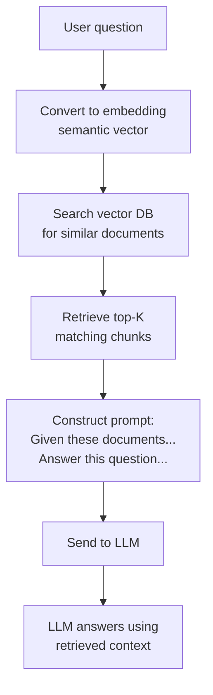

# Pattern 2: Retrieval-Augmented Generation (RAG)

> **In one line:** LLMs are great at reading but bad at memorizing — RAG fixes that by retrieving relevant documents from your data and stuffing them into the prompt before the model answers.

:::tip[In plain English]
The base LLM was trained months or years ago and has never seen your customer database, your internal docs, or last week's product update. RAG is the standard fix: turn the user's question into a vector, search your data for similar vectors, paste the top matches into the prompt, and let the model answer using that context. It plays to the LLM's strength (reading and summarizing) and around its weakness (poor memorization of specifics).
:::

LLMs can answer questions about general knowledge but not your specific data. RAG bridges that gap.

## The concept



> **Jargon used above:**
> - **Embedding:** a numeric vector (typically hundreds to thousands of floats) that represents the *meaning* of a piece of text. Similar meanings end up close together in vector space.
> - **Vector DB:** a database optimized for "find the K vectors closest to this one" queries (instead of "find rows where X = Y").
> - **Top-K:** the K most similar chunks you keep after the similarity search — usually 3 to 20.

## Why it works

LLMs are good at:

- Reading and summarizing text.
- Answering questions from provided context.

LLMs are bad at:

- Memorizing your specific data.
- Knowing what they don't know.

RAG plays to the strength (good reading) and around the weakness (poor memorization).

## A practical RAG pipeline

**Step 1: Ingest documents.**

Take your data (PDFs, web pages, support tickets, code, whatever) and chunk it into pieces of 200–1,000 tokens.

```typescript
// Pseudo-code for ingestion
async function ingest(documents) {
  for (const doc of documents) {
    const chunks = chunkText(doc.content, { maxTokens: 500 });
    for (const chunk of chunks) {
      const embedding = await getEmbedding(chunk.text);
      await db.insert(embeddings).values({
        content: chunk.text,
        documentId: doc.id,
        embedding,  // vector of, e.g., 1536 floats
        metadata: { ...doc.metadata },
      });
    }
  }
}
```

> **In English:** For every document, slice it into ~500-token chunks (small enough that the model can read several of them at once), turn each chunk into an embedding vector, and store the chunk text *plus* its embedding in the database. This runs once at ingestion time, not on every user query.

**Step 2: Get an embedding for a query.**

Embeddings turn text into vectors in a space where similar meanings are close together.

```typescript
async function getEmbedding(text: string): Promise<number[]> {
  const response = await openai.embeddings.create({
    model: 'text-embedding-3-small',
    input: text,
  });
  return response.data[0].embedding;
}
```

> **In English:** Send the text to OpenAI's embedding endpoint. You get back a fixed-length array of floats (1,536 for `text-embedding-3-small`). Two pieces of text with similar meaning produce vectors that are close together — which is what makes the next step possible.

**Step 3: Search the vector DB.**

```typescript
async function findRelevantChunks(query: string, k = 5) {
  const queryEmbedding = await getEmbedding(query);

  // Using pgvector inside Postgres:
  return db.execute(sql`
    SELECT content, document_id
    FROM embeddings
    ORDER BY embedding <=> ${JSON.stringify(queryEmbedding)}
    LIMIT ${k}
  `);
}
```

> **In English:** Embed the user's query the same way you embedded the documents, then ask Postgres for the 5 stored chunks whose embeddings are closest to the query's embedding. `pgvector` (the Postgres extension) does the heavy lifting; you just `ORDER BY` the distance.

The `<=>` operator is **cosine distance** (a number from 0 to 2 measuring the angle between two vectors). Lower distance = more similar meaning.

**Step 4: Construct the prompt.**

```typescript
async function answer(question: string) {
  const chunks = await findRelevantChunks(question, 5);
  const context = chunks.map(c => c.content).join('\n\n---\n\n');

  const result = await generateText({
    model: anthropic('claude-sonnet-4-5'),
    system: 'Answer the user\'s question using only the provided context. If the answer isn\'t in the context, say so.',
    messages: [
      { role: 'user', content: `Context:\n${context}\n\nQuestion: ${question}` },
    ],
  });

  return result.text;
}
```

> **In English:** Retrieve the top 5 chunks, glue them together with separators, paste them into the user message, and tell the model in the *system prompt* to only use what you handed it. The `"if the answer isn't in the context, say so"` clause is a cheap but important defense against the model making things up (hallucinating).

## Vector database choices

- **pgvector** (Postgres extension) — Most popular 2026 choice. One database for everything.
- **Pinecone** — Managed, easy to start with.
- **Qdrant** — Open-source, fast.
- **Weaviate** — Open-source, feature-rich.
- **Turbopuffer** — Newer, cost-optimized for large datasets.

For most apps with under 10M vectors, **pgvector is enough.** Don't add a separate vector DB unless you need to.

## Chunking strategies

How you split documents matters enormously:

- **Fixed-size chunks** — Simple; works for plain text.
- **Sentence-boundary chunks** — Don't split mid-sentence.
- **Semantic chunking** — Group related content (more sophisticated, more compute).
- **Hierarchical chunking** — Multiple chunk sizes; retrieve at different granularities.

Document type matters:

- **Markdown:** Chunk by sections.
- **Code:** Chunk by functions/classes.
- **PDFs:** Often need OCR or special parsing first.
- **Conversations:** Chunk by message groups, preserve context.

## Improving RAG quality

Out of the box, RAG often works "okay." Improvements:

1. **Hybrid search.** Combine semantic search (embeddings) with keyword search (BM25). Often better than either alone.
2. **Reranking.** After initial retrieval, use a more expensive model to rerank the top K. Cohere's reranker is popular.
3. **Query expansion.** Rephrase the user's question multiple ways; search with all variants.
4. **Better prompts.** Tell the model exactly how to use the context.
5. **Better chunks.** Iterate on chunking strategy with eval data.
6. **Metadata filtering.** Filter results by date, author, document type, etc., before semantic ranking.
7. **Citations.** Have the model cite which chunks it used; build a UI that shows sources.

## When RAG doesn't help

- **General knowledge questions.** The base model already knows.
- **Math or precise computation.** Use function calling instead.
- **Real-time data.** RAG queries an indexed snapshot; for live data, query directly.
- **Aggregations.** "How many users signed up last month?" — query the database, not embeddings.

:::note[Worked example: docs bot that actually works]
A team builds a "ask our docs" feature. Their iterations:

1. **v1 — naive RAG.** Chunk every doc into 500-token blocks, embed, retrieve top 5, ask the model. Result: "okay" answers, often missing key info.
2. **v2 — better chunking.** Chunk by markdown section, preserve heading context. Retrieval quality improves measurably.
3. **v3 — hybrid search.** Combine semantic search + BM25 keyword search. Catches exact-term queries the embeddings missed.
4. **v4 — reranking.** Retrieve top 20, rerank with Cohere, keep top 5. Quality jumps again.
5. **v5 — citations.** Have the model cite chunks; show them as links in the UI. Trust and verifiability up.

Each step is a measurable improvement. The lesson: RAG is not a single technique — it's a pipeline you iterate on with eval data.
:::

:::info[Highlight: the most common RAG mistake]
The most common RAG failure isn't bad embeddings — it's **bad chunks**. If your chunks split mid-sentence, mid-section, or away from their headings, the model gets context with no coherent meaning.

Before you optimize anything else, look at the chunks you're feeding the model. If you wouldn't be able to answer the question from those chunks alone, the model won't either.
:::

## Common mistakes

:::caution[Where people commonly trip up]
- **Embedding queries with a different model than the documents.** Vector spaces from different embedding models aren't comparable — your "similarity" search returns noise. Pin the exact embedding model name (and version) in config and refuse to mix. If you migrate models, re-embed the entire corpus.
- **Chunking by token count and ignoring structure.** A 500-token window that slices through the middle of a code block, a table row, or a heading produces garbage chunks. Chunk on natural boundaries first (sections, paragraphs, functions), then enforce the token cap.
- **Returning the chunk text but not its source.** When the model cites "the docs" you have no way to verify or build a citations UI. Always store and return `document_id`, `title`, and `url` alongside the chunk — bake it into the schema so you can't forget.
- **Treating top-K as a knob to turn up.** Bumping K from 5 to 50 usually makes answers *worse*: the model drowns in marginally relevant context and the signal-to-noise ratio collapses. Fix retrieval quality (chunking, reranking, hybrid search) before reaching for more chunks.
- **No "I don't know" path.** If the system prompt doesn't explicitly tell the model what to do when the context doesn't contain the answer, it confabulates. Spell out the fallback ("say you don't have that information and point them to support") and verify in evals.
:::

## Page checkpoint

<Quiz id="ai-rag-page" title="Did RAG stick?" sampleSize={3}>

<Question
  prompt="What problem is RAG primarily solving?"
  options={[
    { text: "Making LLMs respond in fewer tokens to save cost" },
    { text: "Giving the LLM access to specific data it never saw during training, without retraining the model" },
    { text: "Letting the LLM execute SQL queries directly against a production DB" },
    { text: "Reducing the latency of token generation" }
  ]}
  correct={1}
  explanation="LLMs are good readers but poor memorizers of your specifics. RAG retrieves the relevant chunks of your data at query time and pastes them into the prompt so the model can answer from that context."
  revisit={{ to: "/docs/ai/ai-rag#why-it-works", label: "Why RAG works" }}
/>

<Question
  prompt="In a RAG pipeline, when are documents converted into embeddings and stored?"
  options={[
    { text: "Once, ahead of time during an ingestion job" },
    { text: "On every user query, alongside the query embedding" },
    { text: "Only when the model decides it needs them" },
    { text: "After the LLM has produced an answer, for caching" }
  ]}
  correct={0}
  explanation="Ingestion (chunk -> embed -> store) runs once per document update. At query time you only embed the user's question and search — the document embeddings are already sitting in the vector DB."
  revisit={{ to: "/docs/ai/ai-rag#a-practical-rag-pipeline", label: "RAG ingestion vs query time" }}
/>

<Question
  prompt="Which of these tasks is RAG NOT the right tool for?"
  options={[
    { text: "Answering a support question using your product docs" },
    { text: "Letting a chatbot reference last week's internal release notes" },
    { text: "Computing 'how many users signed up last month'" },
    { text: "Summarizing a long internal policy document" }
  ]}
  correct={2}
  explanation="Aggregations and precise computations belong in a real database query, not an embedding search. RAG shines when the answer has to be reasoned out of unstructured text."
  revisit={{ to: "/docs/ai/ai-rag#when-rag-doesnt-help", label: "When RAG does not help" }}
/>

<Question
  prompt="A docs bot is returning vague, confused answers even though embeddings and the model look fine. Where should you look first?"
  options={[
    { text: "Switch to a larger, more expensive LLM" },
    { text: "Inspect the actual chunks being fed to the model — bad chunking is the most common RAG failure" },
    { text: "Increase top-K from 5 to 50" },
    { text: "Replace pgvector with a dedicated vector DB" }
  ]}
  correct={1}
  explanation="If a human couldn't answer the question from the chunks alone, the model can't either. Chunks that split mid-sentence or drop their headings are the most common cause of weak RAG quality."
  revisit={{ to: "/docs/ai/ai-rag#chunking-strategies", label: "Chunking matters most" }}
/>

</Quiz>

## What's next

→ Continue to [Pattern 3: Function Calling / Structured Output](./ai-function-calling) — let the AI call your code or return strictly typed JSON.
