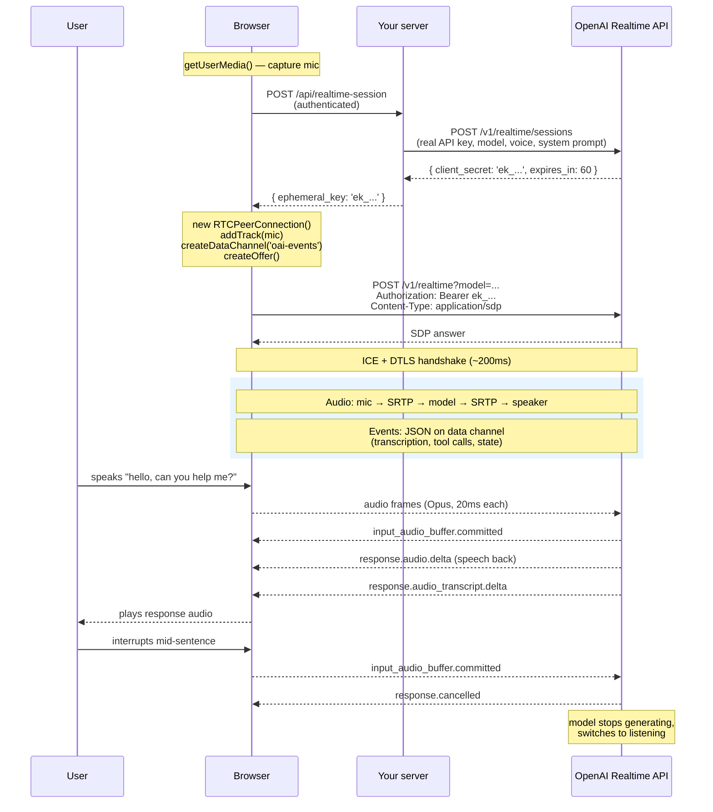

# Pattern 7: Realtime Voice (speech-in, speech-out agents)

> **In one line:** A realtime voice agent listens to the user's microphone, thinks in a single multimodal model, and speaks back over the same low-latency connection — no separate STT + LLM + TTS pipeline, no perceptible round-trip lag.

:::tip[In plain English]
The old way to build a voice AI was three services glued together: speech-to-text (Whisper) → LLM (GPT/Claude) → text-to-speech (ElevenLabs). Three round trips, three failure modes, two seconds of total latency. The 2026 way is *one* multimodal model that takes audio in and emits audio out directly, over a WebRTC connection straight from the browser. End-to-end latency drops to ~300ms — fast enough to feel like a real conversation, including handling interruptions. This is what powers ChatGPT Voice Mode, the OpenAI Realtime API, and the new generation of voice-first products.
:::

This pattern is genuinely different from the other AI patterns. Streaming chat ([Pattern 1](./ai-streaming-chat)) is a fancy `fetch`. Realtime voice is a duplex media stream with a state machine that handles turn-taking, interruption, transcription, and tool calls *concurrently*. You will not implement this with a `fetch`.

## The shape of the system



> **Reading this:** three things distinguish it from streaming chat. (1) Your server is *only* in the auth/setup path; the audio goes browser ↔ OpenAI directly. (2) The media (audio) and the metadata (JSON events) travel on *different* WebRTC sub-streams. (3) Both sides can interrupt at any time — there's no "request" and "response," there's a continuous duplex stream.

## Why WebRTC and not WebSocket?

The OpenAI Realtime API supports both transports, but WebRTC is the default for browser-based use cases because:

| Property | WebSocket | WebRTC |
|----------|-----------|--------|
| Transport | TCP | UDP |
| Behavior on packet loss | Retransmit, head-of-line blocking | Codec conceals, stream continues |
| Audio codec | You handle encoding (usually base64 PCM) | Opus, negotiated end-to-end |
| Round-trip time | ~150ms + TCP retransmit risk | ~50-100ms steady |
| Setup complexity | Trivial | SDP exchange + ICE (one-time, ~300ms) |

For a voice agent where users notice 200ms of extra delay, WebRTC is the obvious choice. For a server-to-server pipeline (e.g., a phone-call bridge running in your backend), WebSocket is simpler. Browser → model: WebRTC.

If you haven't yet, read the [WebRTC page in foundations](../foundations/webrtc) — this whole pattern assumes you understand peer connections, SDP, and ICE.

## Anatomy of a Realtime session

There are five things happening simultaneously over the same connection:

### 1. The audio track (media)

The user's microphone feeds into an `RTCPeerConnection` as a `MediaStreamTrack`. The browser encodes it as Opus and ships ~50 packets per second over UDP. The model's response audio comes back the same way; you attach it to an `<audio>` element to play.

```typescript
const stream = await navigator.mediaDevices.getUserMedia({ audio: true });
const pc = new RTCPeerConnection();
stream.getTracks().forEach((track) => pc.addTrack(track, stream));

pc.ontrack = (event) => {
  audioElement.srcObject = event.streams[0];
};
```

### 2. The data channel (events)

A WebRTC data channel runs alongside the audio for JSON events. The model emits events like:

- `input_audio_buffer.speech_started` — VAD detected the user started talking
- `input_audio_buffer.speech_stopped` — VAD detected the user stopped
- `input_audio_buffer.committed` — what the user said has been finalized
- `conversation.item.input_audio_transcription.completed` — transcript of user's audio
- `response.created` — model is starting to respond
- `response.audio.delta` — chunks of the model's audio (you usually don't process these manually; the audio track does it)
- `response.audio_transcript.delta` — chunks of the model's spoken text (great for displaying captions)
- `response.function_call_arguments.delta` — tool call arguments streaming in
- `response.done` — finished
- `error` — something went wrong

You send events on the same channel:

- `session.update` — change model behavior mid-session (system prompt, voice, tools, VAD settings)
- `conversation.item.create` — inject a message (e.g., system note, or a transcript of something said offline)
- `response.create` — explicitly ask for a response
- `response.cancel` — stop the current response (used for user-interruption logic)

```typescript
const dc = pc.createDataChannel('oai-events');
dc.onmessage = (event) => {
  const msg = JSON.parse(event.data);
  switch (msg.type) {
    case 'response.audio_transcript.delta':
      appendCaption(msg.delta);
      break;
    case 'response.function_call_arguments.done':
      handleToolCall(msg.name, JSON.parse(msg.arguments));
      break;
    // …
  }
};

// Update the system prompt mid-session:
dc.send(JSON.stringify({
  type: 'session.update',
  session: {
    instructions: 'You are now in expert mode — answer in detail.',
  },
}));
```

### 3. VAD (Voice Activity Detection)

The model needs to know *when the user has stopped talking* to decide when to respond. This is **VAD** (voice activity detection). The Realtime API offers two modes:

| Mode | Behavior | Use when |
|------|----------|----------|
| `server_vad` (default) | Server detects silence, automatically commits and triggers a response | Most consumer voice apps |
| `none` | You decide when to commit; server doesn't auto-respond | Push-to-talk UI, structured interviews |

`server_vad` is configured with a silence threshold (typically ~500ms). Too short → model interrupts you mid-pause. Too long → model feels sluggish. The default 500ms is the sweet spot for natural conversation; tune for your use case.

### 4. Interruption (the hardest UX detail)

In a real conversation, you can talk over someone. The model has to handle this gracefully:

1. User starts speaking while the model is mid-sentence.
2. The data channel emits `input_audio_buffer.speech_started`.
3. Your code (or the API automatically) cancels the in-flight response: `dc.send({ type: 'response.cancel' })`.
4. The model immediately stops generating audio.
5. The model's audio track goes silent within ~100ms.
6. The model resumes listening; new audio buffer starts capturing the interruption.

Get this right and the conversation feels natural. Get it wrong and the model keeps talking over the user — instantly uncanny and annoying.

### 5. Function calling

The model can call tools mid-conversation:

```typescript
dc.send(JSON.stringify({
  type: 'session.update',
  session: {
    tools: [
      {
        type: 'function',
        name: 'lookup_order_status',
        description: 'Look up an order status by order ID',
        parameters: {
          type: 'object',
          properties: { order_id: { type: 'string' } },
          required: ['order_id'],
        },
      },
    ],
    tool_choice: 'auto',
  },
}));
```

When the model decides to call the tool, you see streaming `response.function_call_arguments.delta` events. On `response.function_call_arguments.done`:

```typescript
case 'response.function_call_arguments.done': {
  const args = JSON.parse(msg.arguments);
  const result = await lookupOrderStatus(args.order_id);
  dc.send(JSON.stringify({
    type: 'conversation.item.create',
    item: {
      type: 'function_call_output',
      call_id: msg.call_id,
      output: JSON.stringify(result),
    },
  }));
  dc.send(JSON.stringify({ type: 'response.create' }));
  break;
}
```

The model takes the tool result and synthesizes a spoken answer.

## The ephemeral key flow (why your server isn't in the audio path)

The big architectural question: **how does the browser authenticate to OpenAI without your real API key?**

The answer is the ephemeral-key pattern (covered in detail on the [Secrets & API Keys page](../foundations/secrets-and-keys)). In short:

1. Browser asks **your server** for a session token (authenticated as your user).
2. Your server calls OpenAI's `/v1/realtime/sessions` endpoint with the **real API key**, asking for a one-shot client secret.
3. OpenAI returns an `ek_…` token that expires in ~60 seconds.
4. Your server passes the `ek_…` token to the browser.
5. The browser uses `ek_…` directly with OpenAI; your real key never leaves the server.

This is critical because:

- **Cost protection** — if a malicious user scrapes the ephemeral key, they have ~60 seconds to start one session, then it's dead. Your real key is safe.
- **Latency** — the audio goes browser ↔ OpenAI direct. If you proxied through your server, every audio packet would round-trip through your infra, adding 100–200ms.
- **Bandwidth** — voice is ~20-40 kbps; for 10,000 concurrent sessions, that's 200-400 Mbps of audio you don't have to pay your hosting provider for.

```typescript
// app/api/realtime-session/route.ts
import { NextResponse } from 'next/server';
import { getUserFromCookie } from '@/lib/auth';
import { checkRateLimit } from '@/lib/rate-limit';

export async function POST(req: Request) {
  const user = await getUserFromCookie(req);
  if (!user) return new Response('unauthorized', { status: 401 });

  // protect against runaway / abuse — see Rate Limiting page
  const { allowed, retryAfter } = await checkRateLimit(`realtime:${user.id}`, 5, 1/60);
  if (!allowed) {
    return new Response('rate limited', {
      status: 429,
      headers: { 'Retry-After': String(retryAfter) },
    });
  }

  const r = await fetch('https://api.openai.com/v1/realtime/sessions', {
    method: 'POST',
    headers: {
      Authorization: `Bearer ${process.env.OPENAI_API_KEY}`,
      'Content-Type': 'application/json',
    },
    body: JSON.stringify({
      model: 'gpt-realtime',
      voice: 'verse',
      instructions: await buildSystemPrompt(user),
      turn_detection: { type: 'server_vad', threshold: 0.5, silence_duration_ms: 500 },
      tools: getToolsForUser(user),
    }),
  });

  const data = await r.json();
  return NextResponse.json({ clientSecret: data.client_secret.value });
}
```

## The latency budget

Voice feels natural when end-to-end "user stops talking → model starts talking back" is under ~700ms. Above that, conversation feels stilted; under ~300ms, it feels instant.

Where the time goes (typical numbers):

| Hop | Time |
|-----|------|
| VAD detects end of user speech | ~500ms after silence (configurable) |
| Server commits buffer, triggers response | ~50ms |
| Model "thinks" before first audio token | ~250-400ms (this is the irreducible cost; the model has to start generating) |
| First audio packet → browser → speaker | ~100ms |
| **Total user-perceived "thinking" time** | **~1 second from silence to first sound** |

The 500ms VAD silence is the biggest tunable piece. Some teams cut it to 200ms for snappier feel; users get more accidental interrupts in trade.

If you find yourself with > 1.5s of latency:

- Profile each step using the data channel events' timestamps.
- Check that you're using WebRTC (not WebSocket) for transport.
- Check your STUN/TURN config — if traffic relays through TURN unexpectedly, that's a hop you didn't budget for.
- Choose a smaller / faster voice model if available.
- Reduce VAD silence threshold (but pair with explicit "let me think" handling).

## Failure modes specific to realtime voice

| Symptom | Likely cause | Mitigation |
|---------|--------------|------------|
| Mic permission denied | User clicked "deny" or hasn't been asked | Show clear OS-specific instructions; offer push-to-talk fallback |
| 30s in, audio cuts out | WebRTC connection went to `failed` (network change) | Listen for `connectionState === 'failed'`, call `restartIce()`, regenerate offer |
| Model talks over user | Interruption handling missing | Subscribe to `input_audio_buffer.speech_started`, send `response.cancel` immediately |
| Lag spikes mid-conversation | User went from Wi-Fi to cellular, brief packet loss | Opus codec handles small loss; show "reconnecting…" if `disconnected` lasts >2s |
| Cost runs away | Single user / abusive script holds session open | Enforce a max session duration server-side (e.g., 15 minutes) and a per-user concurrency limit |
| Ephemeral key expires before session starts | Network delay between key issuance and SDP POST | Reissue if first call fails; budget for ~60s key lifetime |
| Wrong voice / accent / language | `voice` and `instructions` not set | `session.update` to fix in-session, or correct in your initial `/sessions` POST |
| Garbled audio | Wrong sample rate, codec mismatch | WebRTC handles this for you — if you see it, you've probably reached for WebSocket and mishandled PCM frames |

## Cost protection (the easy way to get a big surprise bill)

Realtime audio is priced per minute, not per token, and it adds up *fast*. A single user holding a session open for an hour costs ~$15 at 2026 prices. Without guardrails, one buggy client (or one curious attacker) can run up four-figure bills overnight.

Layer these defenses:

1. **Hard session cap** — enforce server-side that a single session lives no more than N minutes. Close the connection from your side; don't trust the client to do it.
2. **Per-user concurrency** — max 1 active session per user. Check before issuing the ephemeral key.
3. **Per-user daily budget** — track minutes used per day; refuse new sessions over the cap.
4. **Rate-limit session creation** — see [Rate limiting](../foundations/rate-limiting). 5 sessions per minute per IP is generous and stops most abuse.
5. **Observability** — log session start, duration, model used, tool calls. Build a daily cost dashboard.
6. **Idle timeout** — if no audio activity for 2 minutes, end the session.

The session cap is the single most important one. Without it, one bug (a client that doesn't call `pc.close()` on unload) leaks paid minutes forever.

## When NOT to use realtime voice

It's a great tool, but not for every problem:

| Use realtime voice when | Use text streaming + TTS when |
|-------------------------|------------------------------|
| Conversation is natural and interactive | Output is mostly read, not heard |
| Sub-second latency matters | A 1-2 second extra delay is acceptable |
| Users speak as input | Users type as input |
| Interruption matters | Single-turn responses |
| Multimodal reasoning over speech (tone, hesitation) is useful | Plain text reasoning is enough |

For e.g. a customer support chat where 5% of users want voice and 95% want text, ship text first. Voice is the right hammer for a specific nail, not every nail.

:::info[Highlight: realtime voice is a different engineering discipline]
If you're coming from a "ship a chat UI" background, realtime voice will feel alien. There's no `fetch`, no React state for a "loading" spinner, no notion of a single request and response. It's a long-running duplex stream where five things happen concurrently, the user can interrupt at any time, and your job is to coordinate audio, transcription, tool calls, and UI state from a stream of events. **Budget extra learning time for this pattern — it's worth it, but it's not just "Pattern 1 with audio."**
:::

## Common mistakes

:::caution[Where people commonly trip up]
- **Putting the OpenAI API key in the browser.** Don't. Mint an ephemeral key server-side. The naive approach gets your account drained in hours by a botnet that scraped the bundle.
- **Forgetting the session cap.** A user closes the tab without your `unload` handler firing. The session stays open on OpenAI's side, billing you. Always enforce a server-side max session duration.
- **Ignoring interruption.** The model keeps talking over the user because you never wired `response.cancel`. The first beta test will surface this as the #1 complaint.
- **VAD threshold too short.** 100ms silence threshold means every pause-to-think becomes an interruption. Users feel rushed. 500ms is the default for a reason.
- **Storing audio without consent.** Whether you log the user's audio (or the transcript) is a privacy decision with legal implications in many jurisdictions. Be explicit, give a toggle, and honor "don't store" *technically*, not just in policy.
- **Proxying audio through your server.** A team builds a Next.js Route Handler that receives audio and forwards it to OpenAI to "have control over logging." They've doubled the latency, blown the conversation feel, and added a single point of failure. Use ephemeral keys; let the browser go direct.
- **Treating it like Pattern 1.** A team starts with their streaming-chat code, swaps in an audio element, and is surprised when nothing works. Realtime voice has its own SDK, its own event protocol, and its own state machine. Read the OpenAI Realtime docs end-to-end before you start.
- **No fallback for no-mic users.** Some users won't grant microphone permission. Have a "type instead" path, or a clear "you need to allow your microphone to use this feature" screen.
- **Building it before the system prompt works in text.** If your text-mode interview agent gives away the answer, the voice version will too — but more confidently. Get the prompt strategy right in text first (see [System Prompt Engineering](./ai-system-prompt-engineering)), then upgrade to voice.
:::

## Page checkpoint

<Quiz id="ai-realtime-voice-page" title="Did realtime voice stick?" sampleSize={2}>

<Question
  prompt="Why does the OpenAI Realtime API default to WebRTC instead of WebSocket for browser-based voice agents?"
  options={[
    { text: "WebRTC is easier to set up than WebSocket" },
    { text: "WebRTC uses UDP — a packet loss becomes a 20ms blip the codec conceals, not a multi-hundred-ms TCP retransmit that turns into a noticeable gap in conversation" },
    { text: "OpenAI doesn't support WebSocket" },
    { text: "WebRTC is encrypted; WebSocket isn't" }
  ]}
  correct={1}
  explanation="The transport question is fundamentally about packet loss behavior. TCP retransmits everything in order, which creates audible gaps. UDP lets the codec smooth over small losses. For sub-second conversational latency, you need UDP."
  revisit={{ to: "/docs/ai/ai-realtime-voice#why-webrtc-and-not-websocket", label: "Why WebRTC for voice" }}
/>

<Question
  prompt="In the standard architecture for a browser voice agent talking to OpenAI Realtime, where does the audio flow?"
  options={[
    { text: "Browser → your server → OpenAI → your server → browser" },
    { text: "Browser → OpenAI directly, after your server hands the browser an ephemeral key; your server is out of the audio path entirely" },
    { text: "Through a Twilio relay" },
    { text: "Over the same WebSocket your server uses for normal API calls" }
  ]}
  correct={1}
  explanation="The ephemeral-key pattern lets the browser authenticate to OpenAI without holding your real key — so the audio can flow directly over WebRTC, avoiding the latency and bandwidth cost of relaying through your backend."
  revisit={{ to: "/docs/ai/ai-realtime-voice#the-ephemeral-key-flow-why-your-server-isnt-in-the-audio-path", label: "Ephemeral key flow" }}
/>

<Question
  prompt="A team ships a realtime voice feature without a server-enforced session cap. What's the most likely catastrophic failure mode?"
  options={[
    { text: "Users complain about poor audio quality" },
    { text: "A client that doesn't call `pc.close()` (or a bot) leaves sessions open indefinitely, accruing per-minute charges — overnight cost can run into thousands of dollars from a single bad actor" },
    { text: "The model refuses to respond" },
    { text: "WebRTC connections become slow" }
  ]}
  correct={1}
  explanation="Realtime audio is billed per minute. Without a server-side max-duration enforcement, one bug or one attacker can hold sessions open arbitrarily long. Always cap on the server, ideally to ~15 minutes max — plus per-user concurrency and daily budgets."
  revisit={{ to: "/docs/ai/ai-realtime-voice#cost-protection-the-easy-way-to-get-a-big-surprise-bill", label: "Cost protection" }}
/>

<Question
  prompt="The model is talking. The user starts talking. What needs to happen for the conversation to feel natural?"
  options={[
    { text: "The model finishes its sentence, then listens" },
    { text: "Your code (on `input_audio_buffer.speech_started`) sends `response.cancel`, the model stops generating within ~100ms, and the model resumes listening to the user's interruption" },
    { text: "The user has to click a 'stop' button" },
    { text: "WebRTC handles interruption automatically with no code from you" }
  ]}
  correct={1}
  explanation="The interruption handshake is the most-overlooked UX detail. Subscribe to the 'user started talking' event, cancel the response, let the model fall back to listening. Without it, the model talks over the user — unmistakably broken-feeling."
  revisit={{ to: "/docs/ai/ai-realtime-voice#4-interruption-the-hardest-ux-detail", label: "Interruption handling" }}
/>

<Question
  prompt="A team wants to log every word the user says for analytics. Their plan: proxy audio through their server, save to S3, then forward to OpenAI. What's wrong with this plan?"
  options={[
    { text: "S3 doesn't accept audio" },
    { text: "It doubles latency (every audio packet round-trips through your server), bloats your bandwidth bill, adds a SPOF in your infra, and is unnecessary — you can subscribe to the transcription event stream on the data channel and log transcripts without proxying audio" },
    { text: "Audio can't be saved without user consent" },
    { text: "WebSocket can't carry audio bytes" }
  ]}
  correct={1}
  explanation="If you need transcripts for analytics, get them from the data channel events (the model already emits transcription). Proxying audio just to log it doubles latency and costs and adds failure surface — for a value you can already get from the events."
  revisit={{ to: "/docs/ai/ai-realtime-voice#common-mistakes", label: "Don't proxy audio for logging" }}
/>

</Quiz>

## What's next

→ Continue to [On-Device AI](./ai-on-device) — running models in the browser itself, for privacy, offline, and zero cost-per-call.
