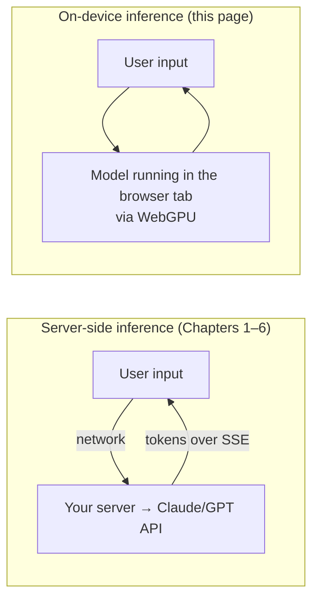

# On-Device AI: running models in the browser

> **In one line:** Instead of calling a model API on a server, you can download a small model into the user's browser and run inference *on their device* using the GPU — no network, no per-call cost, and the data never leaves the page. Great for some features, wrong for others.

:::tip[In plain English]
Every pattern so far in this chapter sends the user's text to a server, which calls Claude/GPT/Gemini and streams the answer back. **On-device AI flips that:** the model itself runs inside the browser tab. The user's input is processed on their own laptop or phone. Nothing is sent anywhere. This is suddenly practical in 2026 because browsers can now hand JavaScript real GPU power (WebGPU), and small, quantized models are good enough for a real class of tasks.
:::

:::note[Level: friendly to read, the *patterns* are durable]
The durable ideas here — *where* inference runs, and the trade between privacy/cost and model power — won't change. The specific browser feature (WebGPU), the library (transformers.js), and the dates *are* the dated layer. They're stamped below so you can refresh them without touching the lesson's logic.
:::

:::info[Terms, defined once]
- **Inference** — running a trained model to get an output (as opposed to *training* it). "On-device inference" = doing that run on the user's machine.
- **WebGPU** — a browser API that gives JavaScript near-native access to the device's GPU, for graphics *and* general compute (including AI). The successor to the older, graphics-only WebGL.
- **transformers.js** — Hugging Face's JavaScript library for running Transformer models in the browser (and Node), with a WebGPU backend.
- **Quantization** — shrinking a model by storing its numbers at lower precision (e.g. 8-bit or 4-bit instead of 16-bit). A quantized model is smaller and faster to run, with a small quality cost — this is what makes browser-sized models feasible.
- **ONNX** — an open model format; transformers.js runs models exported to ONNX via ONNX Runtime Web.
:::

## The mental model: where does inference run?

There are two places a model can run, and on-device AI is simply choosing the second:



The server path is the default for anything needing a frontier model. The on-device path becomes attractive when **privacy, offline support, or per-call cost** matter more than raw model capability.

## Why it's suddenly viable (as of mid-2026)

Two things lined up:

1. **WebGPU reached cross-browser availability.** As of early 2026, WebGPU ships in Chrome, Safari, *and* Firefox — covering the large majority of users. That gives in-browser code real GPU compute, the thing AI inference needs.
2. **Small models got good, and tooling got easy.** Quantized models under ~1–2 GB now run at interactive speeds on ordinary consumer hardware. Libraries like transformers.js made loading and running them a few lines of code.

The result: the browser is now a legitimate inference runtime for a real class of tasks — embeddings, classification, translation, speech-to-text (Whisper), small chat/summarization models, and most vision models.

## A worked example: in-browser sentiment, zero server calls

transformers.js exposes a `pipeline()` helper. The first call downloads and caches the model; after that it runs entirely locally.

```typescript
import { pipeline } from '@huggingface/transformers';

// Create a sentiment classifier that runs on the GPU, in the browser.
// First run downloads the (quantized) model; the browser caches it.
const classify = await pipeline(
  'sentiment-analysis',
  'Xenova/distilbert-base-uncased-finetuned-sst-2-english',
  { device: 'webgpu' }   // ← run on the GPU; omit to fall back to WASM/CPU
);

const result = await classify('This guide is genuinely excellent.');
// → [{ label: 'POSITIVE', score: 0.9998 }]
```

> **In English:** `pipeline('sentiment-analysis', model)` builds a ready-to-use classifier. The `device: 'webgpu'` option runs it on the user's GPU; the WebAssembly/CPU path is the automatic fallback when WebGPU isn't there. The user's text is classified on *their* machine — it never touches your server. There is no API key, no network round-trip per call, and no per-token bill.

Trace what happens the first time vs. later:

- **First use:** the browser downloads the quantized model (tens to a few hundred MB for a classifier; larger for chat models) and caches it. There's a one-time cold start.
- **Every use after:** inference runs locally from cache. No network, no cost, works offline. A Whisper speech-to-text model on WebGPU runs roughly **~5× faster** than the older WebAssembly-only path — the GPU is doing the heavy lifting.

## Why it matters: the three real wins

- **Privacy.** The data is processed on the device and never sent anywhere. This is decisive for sensitive inputs — medical notes, legal text, personal journals — and for compliance stories ("we literally cannot see your data").
- **Offline.** Once the model is cached, the feature works with no connection. Field apps, PWAs, and flaky-network scenarios all benefit.
- **Zero cost-per-call.** Server inference bills you per token forever. On-device inference is paid for by the user's hardware — your marginal cost per inference is **$0**. For a high-volume, low-stakes feature (autocomplete, on-the-fly classification, search ranking), that economics can be the whole reason to do it.

## When NOT to use it (the honest limits)

On-device AI is a sharp tool with real edges. Reach for a server model instead when:

- **You need a frontier model.** The biggest reasoning models do not fit in a browser. On-device means *small* models — fine for classification, embeddings, translation, transcription, light chat; not for hard multi-step reasoning or your flagship copilot.
- **The download is too heavy for the audience.** A useful chat model can be hundreds of MB to a couple of GB. On a marketing page or a mobile-data user, that first-load cost is unacceptable. Weigh the model size against how often the feature is used.
- **Device reach is uneven.** WebGPU is broadly available but not universal, and a 5-year-old phone with little RAM will struggle or fall back to slow CPU inference. You need a graceful fallback (server API, or "feature unavailable here") and should test on low-end hardware, not just your dev machine.
- **You need consistent, auditable output.** Server-side gives you central logging, evals, and prompt updates without shipping a new model to every client. On-device pins the model in the user's cache until they reload your app.

The pragmatic pattern is **hybrid**: run the cheap, private, high-volume task on-device, and call a server model for the heavy reasoning — the same tiered thinking as [model-tiering](./ai-costs), just with "the device" as your cheapest tier.

:::note[Dated one-liner: Chrome's built-in Prompt API / `window.ai`]
Separately from transformers.js, Chromium has been trialing a **built-in** on-device model exposed as a `window.ai` / Prompt API (so you don't ship your own model). As of mid-2026 it's a **Chromium origin trial** — experimental, Chrome-only, and not something to build a cross-browser feature on. Know it exists; don't depend on it yet. The portable, works-today approach is WebGPU + transformers.js above.
:::

## Common mistakes

:::caution[Where people commonly trip up]
- **Shipping a multi-hundred-MB model download to every visitor.** The model loads lazily and the user pays the bandwidth. Gate the download behind an explicit user action ("Enable offline transcription"), show progress, and cache aggressively — don't auto-download on page load.
- **Assuming WebGPU is always there.** It's broadly available but not universal, and some devices fall back to slow CPU inference. Detect support (`'gpu' in navigator`), provide a fallback path (server API or a disabled state), and test on a low-end device.
- **Blocking the main thread with inference.** Running a model on the UI thread freezes the page. Run transformers.js in a **Web Worker** so the tab stays responsive while the model computes.
- **Using on-device for a task that needs a frontier model.** A small browser model can't do your hardest reasoning. Match the model to the task; keep the heavy reasoning server-side and reserve on-device for classification/embeddings/translation/transcription.
- **Forgetting that on-device pins the model client-side.** You can't hot-fix a bad prompt or swap the model the way you can server-side — users keep the cached version until they reload. Version your model assets and plan how updates roll out.
:::

## Page checkpoint

<Quiz id="ai-on-device-page" title="Did on-device AI stick?" sampleSize={2}>

<Question
  prompt="What fundamentally distinguishes on-device AI from the streaming-chat / RAG patterns earlier in this chapter?"
  options={[
    { text: "It uses a different prompt format" },
    { text: "The model runs in the user's browser via WebGPU, so input is processed locally — no server API call, no per-call cost, and the data never leaves the device" },
    { text: "It only works for image generation" },
    { text: "It requires a paid API key per request" }
  ]}
  correct={1}
  explanation="On-device inference flips where the model runs: from your server (calling Claude/GPT) to the user's own GPU in the browser. That's what delivers privacy, offline support, and zero cost-per-call."
  revisit={{ to: "/docs/ai/ai-on-device#the-mental-model-where-does-inference-run", label: "Where inference runs" }}
/>

<Question
  prompt="Which task is the BEST fit for on-device inference, and which is the worst?"
  options={[
    { text: "Best: your flagship multi-step reasoning copilot. Worst: classifying a sentence." },
    { text: "Best: in-browser sentiment classification / translation / transcription. Worst: hard multi-step reasoning needing a frontier model." },
    { text: "Best: anything, on-device always wins. Worst: nothing." },
    { text: "Best: tasks that need central audit logs. Worst: offline tasks." }
  ]}
  correct={1}
  explanation="On-device means small models — great for classification, embeddings, translation, and transcription, where privacy/offline/zero-cost matter. Frontier-scale reasoning doesn't fit in a browser; keep that server-side. The pragmatic pattern is hybrid."
  revisit={{ to: "/docs/ai/ai-on-device#when-not-to-use-it-the-honest-limits", label: "When not to use it" }}
/>

<Question
  prompt="Why is on-device AI 'suddenly viable' as of mid-2026, and what's the right way to treat Chrome's built-in window.ai / Prompt API?"
  options={[
    { text: "Because models got bigger; and window.ai is the cross-browser standard to build on now" },
    { text: "Because WebGPU reached cross-browser availability and small quantized models got good enough; window.ai is a Chromium origin trial — know it exists, don't depend on it yet" },
    { text: "Because servers got cheaper; and window.ai should replace transformers.js immediately" },
    { text: "Because WebAssembly was finally invented; and window.ai works in every browser" }
  ]}
  correct={1}
  explanation="WebGPU (GPU access in the browser) landing across Chrome/Safari/Firefox, plus quantized models running at interactive speed, is what made it practical. Chrome's built-in window.ai is still an experimental, Chrome-only origin trial — the portable approach is WebGPU + transformers.js."
  revisit={{ to: "/docs/ai/ai-on-device#why-its-suddenly-viable-as-of-mid-2026", label: "Why it's viable now" }}
/>

</Quiz>

## What's next

→ Continue to [AI Observability](./ai-observability) — once you ship AI features (server-side or on-device), you need logging, evals, and drift detection to operate them.
