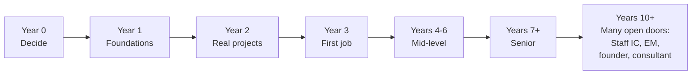

# A Realistic Multi-Year Path

> **In one line:** Year 0 decide; Years 1–2 foundations + real projects; Year 3 first job; Years 4–6 mid-level; Years 7+ senior; Years 10+ many open doors.

:::tip In plain English
Careers don't move in months — they move in years. The path below is the median, not the maximum or minimum. Some people compress it; some take longer. Don't compare yourself to outliers on Twitter; compare yourself to where *you* were a year ago.
:::

A common trajectory:

## Year 0: Decide to Learn

- Pick a path (full-stack web development).
- Commit time (5–10 hours/week minimum).
- Set up your environment.

## Year 1: Foundations

- HTML, CSS, JavaScript fundamentals.
- Build small projects: a calculator, a todo app, a portfolio.
- Learn Git, basic command line.
- Start writing about what you learn.

## Year 2: Real Projects

- Learn React + Next.js (or chosen framework).
- Build 2–3 real projects with backend + auth + database.
- Deploy them; share publicly.
- Begin contributing to open source.
- Start applying for jobs / internships.

## Year 3: First Job

- Land first job (probably after several months of search).
- Focus on doing the job well; learn from your team.
- Watch how experienced engineers work.
- Continue side projects.

## Years 4–6: Mid-Level

- Take on increasing responsibility.
- Maybe switch jobs once (often a significant comp jump).
- Develop areas of depth.
- Mentor newer engineers.

## Years 7+: Senior

- Lead projects.
- Make architectural decisions.
- Mentor junior + mid engineers.
- Choose: stay IC and aim for Staff/Principal, or move into management.

## Years 10+: Senior Choices

By this point you have options. Some patterns:
- **Stay at one big company** through Staff/Principal levels.
- **Bounce between scale-ups** at senior IC level.
- **Start a company.**
- **Become an independent consultant.**
- **Move into research / academia.**
- **Move into education / content creation.**

There's no single "right" path. The skills you've built open many doors.

:::note Worked example: a Year-2 weekly schedule
Concretely, here's what a productive Year 2 might look like for someone working 10 hours/week:

- **Mon evening (2 hrs):** Work on current project — push a feature.
- **Wed evening (2 hrs):** Read documentation or a tutorial on a topic the project demands.
- **Sat morning (3 hrs):** Long deep-work session on the project; deploy something.
- **Sat afternoon (1 hr):** Write a short blog post about what you shipped this week.
- **Sun (2 hrs):** Apply to internships, browse open-source issues, or contribute one small PR.

That cadence — sustained for 12 months — is what gets you to "real projects, deployed, written about" by Year 3.
:::

:::info Highlight: compound interest is the real model
A single week of work is barely visible on your portfolio. A year of weeks is a transformation. The engineers who succeed are not the ones who sprinted for three months — they're the ones who showed up most weeks for three years. **Consistency beats intensity at every stage.**
:::

## What's next

→ Continue to [For Tony Specifically (or Anyone in His Position)](./career-for-tony) for advice tailored to a CS Master's student.
